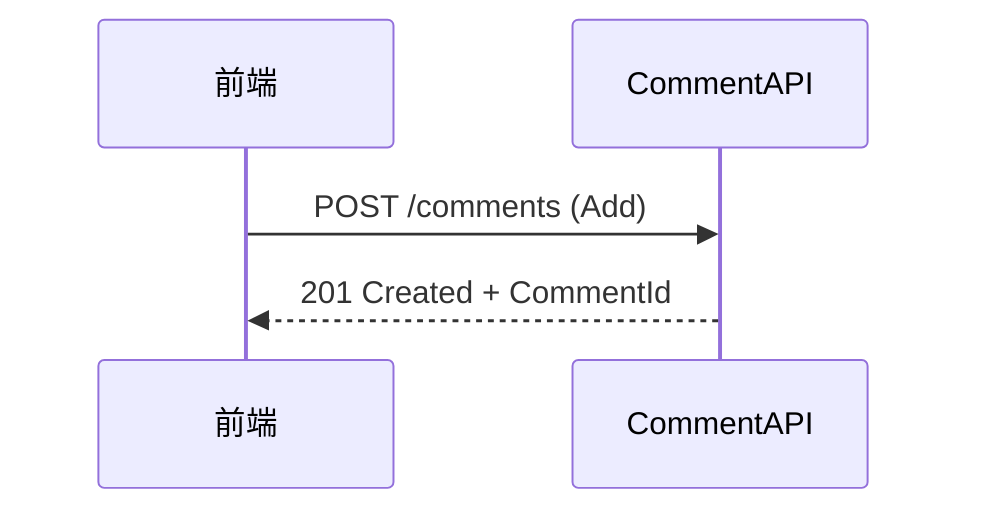

# Comment 模組開發計劃

## 3.3 Comment 模組

### 3.3.1 User Stories
| US   | 身份   | 目標           | 原因         | 優先 | 驗收標準                                      |
|------|--------|----------------|--------------|------|-----------------------------------------------|
| C-001| 用戶   | 發表回覆       | 參與討論     | 高   | 201 `CommentDto`、階層關聯、圖片≤2           |
| C-002| 作者   | 編輯回覆       | 修正內容     | 中   | 204                                          |
| C-003| 作者   | 刪除回覆       | 管理內容     | 中   | 204                                          |
| C-004| 訪客   | 瀏覽回覆       | 發現討論     | 高   | 200 分頁結果                                 |

### 3.3.2 Backend Design
- API 端點設計：
  - `POST /api/comments`：新增回覆，驗證登入、權限、內容長度、圖片數量（≤2）。
  - `PUT /api/comments/{id}`：編輯回覆，僅作者可編輯，驗證內容、權限。
  - `DELETE /api/comments/{id}`：刪除回覆，僅作者可刪除，需同步刪除相關 Likes、Mentions。
  - `GET /api/comments/{id}`：取得單一回覆，權限檢查（私密貼文僅作者/管理員可見）。
  - `GET /api/comments?postId=...`：分頁查詢回覆，支援階層結構、分頁、排序。
- Service 介面：
  - `Task<CommentDto> AddAsync(AddCommentRequest req, CancellationToken ct)`
  - `Task EditAsync(EditCommentRequest req, CancellationToken ct)`
  - `Task DeleteAsync(int commentId, CancellationToken ct)`
  - `Task<CommentDto> GetAsync(int commentId, CancellationToken ct)`
  - `Task<Paginated<CommentDto>> ListAsync(CommentQuery query, CancellationToken ct)`
- DTO：`CommentDto`, `AddCommentRequest`, `EditCommentRequest`, `CommentQuery`
- 權限檢查（作者、管理員）、資料驗證、圖片處理、@mention 解析與觸發通知
- 刪除時同步清理 Likes、Mentions 多對多關聯
- 支援分頁、階層結構查詢

### 3.3.3 Backend Unit Tests
| ID      | 情境            | 預期         |
|---------|-----------------|--------------|
| UT-C-01 | 非作者編輯      | Forbidden    |
| UT-C-02 | 非作者刪除      | Forbidden    |
| UT-C-03 | 私密貼文下回覆  | 權限檢查     |
| UT-C-04 | 刪除回覆同步清理| Likes/Mentions 清理 |
| UT-C-05 | 圖片/標籤關聯   | 關聯正確     |

### 3.3.4 流程圖


### 3.3.5 Frontend UI Design
- `CommentEditor.vue`：
  - 富文本編輯器（支援 Markdown/Quill）、@mention 自動完成
  - 圖片拖曳/上傳（最多2張）、預覽、刪除
  - 表單驗證（內容長度、圖片數量）
  - 發佈、儲存草稿、取消
- `CommentList.vue`：
  - 階層結構顯示、分頁載入、載入更多
  - 根據權限顯示/隱藏私密回覆
  - 無資料/載入中狀態提示
- `CommentCard.vue`：
  - 顯示單一回覆摘要（內容、作者、時間、圖片、@mention 標記）
  - 編輯/刪除按鈕（僅作者可見）
  - 支援展開/收合子回覆

### 3.3.6 Frontend Development
- 編輯器整合（Quill/Markdown）、@mention 自動完成與高亮
- 圖片上傳元件整合，支援預覽、刪除、格式與數量驗證
- API 串接（新增、編輯、刪除、分頁查詢），錯誤與 loading 狀態處理
- 狀態管理（useCommentStore）：緩存分頁、階層結構、權限狀態
- 分頁載入、階層渲染、無資料/載入中提示
- 權限檢查（僅作者可編輯/刪除，私密回覆僅作者/管理員可見）
- 單元測試與 E2E 測試覆蓋所有互動路徑

### 3.3.7 Frontend Tests
- Vitest：單元測試 CommentEditor、CommentList、CommentCard
- Playwright：發表、編輯、刪除、瀏覽全流程
- 覆蓋率報告

### 3.3.8 Build Checklist
- 主 bundle ≤300 kB gzip
- Lighthouse ≥90
- XSS/CSRF 防護
- SEO 標籤

### 3.4 Comment 模組開發檢查清單

#### 用戶故事實現狀態
- [ ] C-001: 用戶發表回覆 [201 `CommentDto`、階層、圖片≤2、驗證]
- [ ] C-002: 作者編輯回覆 [204、權限檢查、驗證]
- [ ] C-003: 作者刪除回覆 [204、權限檢查、同步清理]
- [ ] C-004: 訪客瀏覽回覆 [200 分頁結果、權限過濾]

#### 後端設計與實現
- [ ] 定義 `ICommentService` 介面與 API 端點
- [ ] 權限檢查、資料驗證、圖片/mention 處理
- [ ] DTO 與階層結構、分頁查詢
- [ ] 刪除時同步清理 Likes、Mentions

#### 後端單元測試
- [ ] UT-C-01: 非作者編輯測試 [Forbidden]
- [ ] UT-C-02: 非作者刪除測試 [Forbidden]
- [ ] UT-C-03: 私密貼文下回覆權限 [檢查]
- [ ] UT-C-04: 刪除回覆同步清理 Likes/Mentions
- [ ] UT-C-05: 圖片/標籤關聯完整性 [關聯正確]
- [ ] 單元測試覆蓋率達標

#### 流程圖
- [ ] 回覆流程圖實現與文檔一致

#### 前端 UI 設計
- [ ] 設計並實現 `CommentEditor.vue`（編輯器、@mention、圖片驗證）
- [ ] 設計並實現 `CommentList.vue`（階層、分頁、權限過濾）
- [ ] 設計並實現 `CommentCard.vue`（摘要、操作、權限）

#### 前端開發
- [ ] 編輯器整合、@mention、圖片驗證
- [ ] API 串接、狀態管理、分頁、階層渲染
- [ ] 權限檢查、錯誤/loading 處理

#### 前端測試
- [ ] Vitest 單元測試（CommentEditor、CommentList、CommentCard）
- [ ] Playwright 全流程 E2E 測試
- [ ] 覆蓋率報告

#### 構建檢查項
- [ ] 主 bundle ≤300 kB gzip
- [ ] Lighthouse 性能得分 ≥90
- [ ] XSS/CSRF 防護
- [ ] SEO 標籤

- [ ] Lighthouse 性能得分 ≥90
- [ ] XSS/CSRF 防護
- [ ] SEO 標籤

---

## 開發區檔案結構注意事項
### 後端注意事項
#### 後端使用技術

使用 Furion 框架，
API開發請參考位置: https://help.zhouy1.com/furion/docs/dynamic-api-controller
依賴注入與控制反轉請參考位置: https://help.zhouy1.com/furion/docs/dependency-injection
其他請參閱 https://help.zhouy1.com/furion/docs
#### 後端API存放位置:
Backend\Parent\KidUpgrade.Application\Forum
依照各模組的命名方式命名，並存放在與模組命名相同的目錄下
#### 後端Service存放位置:
Backend\Parent\KidUpgrade.Application\Forum
依照各模組的命名方式命名，並存放在與模組命名相同的目錄下

#### 後端DTO存放位置:
Backend\Parent\KidUpgrade.Application\Forum
依照各模組的命名方式命名，並存放在與模組命名相同的目錄下的Dto目錄下

#### 後端Unit Test存放位置:
Backend\Parent\KidUpGrade.Application.UnitTest
依照各模組的命名方式命名，並存放在與模組命名相同的目錄下的Test目錄下

### 前端注意事項
#### 前端使用技術
使用 Vue3 + Vite + Pinia + TypeScript
UI框架使用 Vuetify
Vuetify 的使用請參閱 https://v3.vuetifyjs.com/en/getting-started/quick-start

#### 展示頁面存放位置:
Frontend\Parent\src\pages\Forum

#### 展示頁面 i18n存放位置:
Frontend\Parent\src\pages\i18n\Forum
頁面使用i18n時，要使用 Frontend\Parent\src\plugins\i18n\index.ts 的 loadPageI18n

#### 模組存放位置:
Frontend\Parent\src\components\Forum

#### 模組i18n存放位置:
Frontend\Parent\src\components\i18n\Forum
模組使用i18n時，要使用 Frontend\Parent\src\plugins\i18n\index.ts 的 loadComponentI18n
#### 模組store存放位置:
Frontend\Parent\src\stores\modules\Forum

#### 前端API存放位置:
Frontend\Parent\src\api-services

### 前後端溝通與交換注意事項
#### 前後端溝通
後端新增API後，請需要執行以下指令:
```
先確定後端是否已經執行 dotnet run
然後執行 pnpm api
將後端所開發的API與Dto轉譯到前端的 Frontend\Parent\src\api-services
```