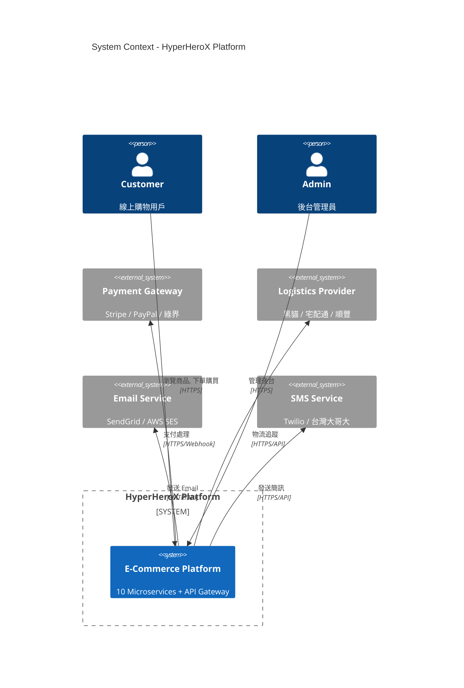
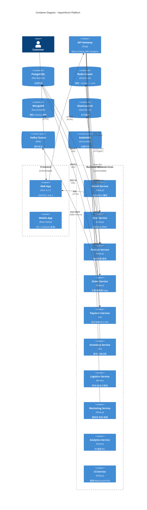
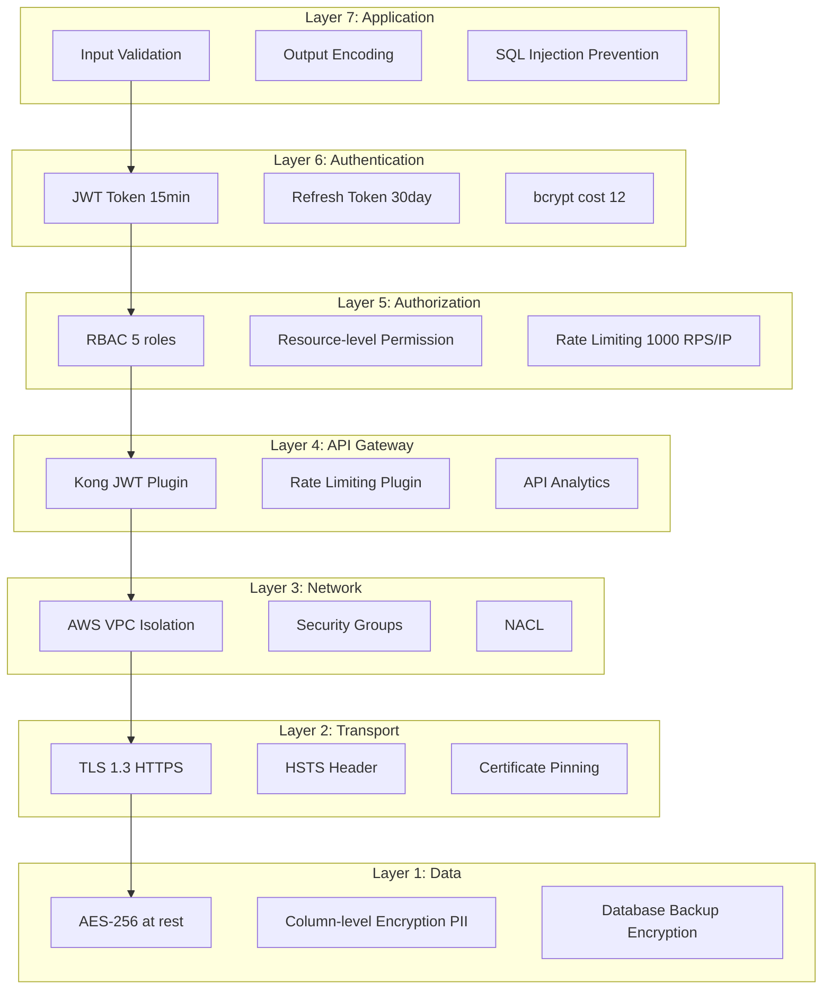
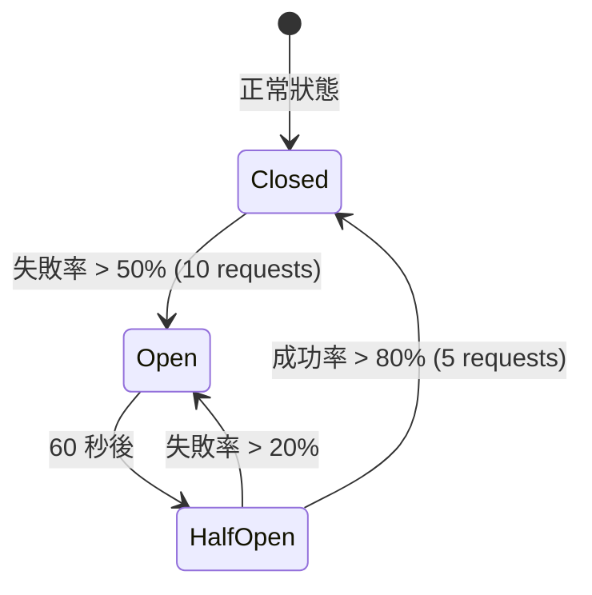

# 系統架構規範 (System Architecture Specification)

> **Version**: 1.0  
> **Last Updated**: 2026-01-31  
> **Maintainer**: HyperHeroX Team  
> **Status**: ✅ Active  
> **Reference**: [stress-test-architect-output.md](../../test/multilang-test/stress-test-architect-output.md)

---

## 📋 概述 (Overview)

本文檔定義 HyperHeroX Skills 專案的系統架構標準，包含架構風格、設計原則、微服務設計、安全架構、擴展性架構等。所有系統設計必須遵循本規範。

---

## 🎯 架構原則 (Architecture Principles)

| 原則 | 說明 | 實作方式 |
|------|------|---------|
| **Scalability First** | 支援 10x-100x 流量成長 | Horizontal Scaling, Microservices, Auto Scaling |
| **Resilience** | 單一服務故障不影響整體系統 | Circuit Breaker, Bulkhead, Retry, Fallback |
| **Security** | 多層防禦 + 零信任 | Defense in Depth, Zero Trust, Least Privilege |
| **Observability** | 全域可觀測性 | Distributed Tracing, Centralized Logging, Real-time Monitoring |
| **Cost Efficiency** | 按需擴展 + 資源優化 | Auto Scaling, Spot Instances, Reserved Instances |

---

## 🏗️ 架構風格 (Architecture Style)

### 選擇：Microservices with Event-Driven Architecture ✅

#### 架構比較 (Architecture Comparison)

| 架構風格 | 優點 | 缺點 | 適用場景 | 採用? |
|---------|------|------|---------|------|
| **Monolith** | ✅ 開發簡單<br>✅ 部署簡單<br>✅ 交易簡單 (ACID) | ❌ 擴展困難 (垂直擴展)<br>❌ 技術棧單一<br>❌ 單點故障<br>❌ 團隊協作困難 | 小型專案 (<10 人團隊) | ❌ |
| **Microservices** | ✅ 獨立擴展<br>✅ 技術多樣性<br>✅ 容錯隔離<br>✅ 團隊自主 | ❌ 複雜度高<br>❌ 資料一致性困難<br>❌ 網路延遲<br>❌ Ops 負擔重 | 大型專案 (50+ 人團隊) | ✅ **採用** |
| **Serverless** | ✅ 自動擴展<br>✅ 成本低 (按用量計費)<br>✅ Ops 負擔低 | ❌ Cold Start 延遲 (1-3s)<br>❌ 執行時間限制 (15 min)<br>❌ 資料庫連線池困難 | Event-driven 任務 (非同步處理) | ⚠️ 部分採用 (非同步任務) |

#### 決策 (Decision)
✅ **採用 Microservices with Event-Driven Architecture**

#### 理由 (Rationale)
1. **規模**: 預期 100K+ DAU, 1000+ orders/sec → 需要水平擴展
2. **團隊**: 50+ 人團隊 → 需要服務自主性
3. **技術棧**: Node.js + Python + Go → 需要技術多樣性
4. **容錯**: Payment 掛了不影響 Product → 需要容錯隔離

---

## 🧱 C4 Model - 系統架構圖

### Level 1: System Context Diagram (系統情境圖)



### Level 2: Container Diagram (容器圖)



---

## 🔧 微服務設計 (Microservice Design)

### 微服務清單 (Microservice List)

| 服務名稱 | 技術棧 | 職責 | 資料庫 | 通訊方式 |
|---------|--------|------|--------|---------|
| **User Service** | Node.js | 註冊, 登入, JWT, RBAC | PostgreSQL | REST + gRPC |
| **Product Service** | Node.js | 商品管理, 搜尋, 推薦 | PostgreSQL + Elasticsearch | REST + gRPC |
| **Order Service** | Node.js | 訂單, 購物車, Saga Pattern | PostgreSQL + Kafka | REST + gRPC |
| **Payment Service** | Go | 支付, 退款, PCI DSS | PostgreSQL | REST + gRPC |
| **Inventory Service** | Go | 庫存, 扣減, 補貨, 分散式鎖 | PostgreSQL + Redis | REST + gRPC |
| **Logistics Service** | Python | 物流, 追蹤, AI 預測 | MongoDB | REST |
| **Marketing Service** | Node.js | 優惠券, 會員, 推播 | PostgreSQL + Redis | REST + gRPC |
| **Analytics Service** | Python | BI, 報表, ML 推薦 | Elasticsearch + MongoDB | REST |
| **CS Service** | Node.js | 客服, WebSocket, FAQ | MongoDB | REST + WebSocket |
| **Admin Service** | Node.js | 後台, RBAC, 審核 | PostgreSQL | REST + gRPC |

### 服務通訊模式 (Service Communication Pattern)

#### 同步通訊 (Synchronous Communication)
- **RESTful API**: 前端 → API Gateway → 微服務 (HTTP/JSON)
- **gRPC**: 微服務 ↔ 微服務 (內部通訊, Protocol Buffers, 低延遲 < 5ms)

#### 非同步通訊 (Asynchronous Communication)
- **Kafka**: 事件串流 (Order Created → Inventory Updated → Payment Processed)
- **RabbitMQ**: 任務佇列 (發送 Email, 發送 SMS, 推播通知)

---

## 🔐 安全架構 (Security Architecture)

### Defense in Depth (多層防禦)



### OWASP Top 10 Mitigation (OWASP Top 10 緩解)

| OWASP Risk | 威脅 | 緩解措施 | 實作位置 |
|-----------|------|---------|---------|
| **#1** | Injection (SQL Injection) | ✅ Parameterized Queries (Prepared Statements) | All Services (PostgreSQL) |
| **#2** | Broken Authentication | ✅ JWT (15 min) + bcrypt (cost 12) + MFA (TOTP) | User Service |
| **#3** | Sensitive Data Exposure | ✅ AES-256 (at rest) + TLS 1.3 (in transit) | All Services |
| **#5** | Broken Access Control | ✅ RBAC (5 roles) + Resource-level permissions | User Service + All Services |
| **#7** | XSS | ✅ CSP Header + Output Encoding (Vue 內建) | Web App (Nuxt) |
| **#8** | Insecure Deserialization | ✅ JSON Schema Validation (Ajv) | API Gateway (Kong) |
| **#10** | Insufficient Logging | ✅ Centralized Logging (Elasticsearch) + Audit Trail | All Services |

### PCI DSS Level 1 Compliance (PCI DSS Level 1 合規性)

**適用範圍**: Payment Service (支付服務)

| Requirement | 措施 | 驗證方式 |
|-------------|------|---------|
| **Req 1**: 防火牆保護 | AWS VPC, Security Groups, NACL | ✅ AWS Config Rules |
| **Req 2**: 不使用預設密碼 | AWS Secrets Manager, 強制密碼策略 (12+ 字元) | ✅ IAM Policy |
| **Req 3**: 保護儲存的持卡人資料 | AES-256, 卡號 Tokenization (Stripe Vault) | ✅ KMS Audit Log |
| **Req 4**: 傳輸加密 | TLS 1.3, HTTPS only | ✅ ALB Listener Policy |
| **Req 8**: 識別與驗證 | MFA (TOTP), JWT 15min expiry | ✅ User Service Log |
| **Req 10**: 追蹤與監控 | AWS CloudWatch Logs, Audit Trail (每筆交易) | ✅ SIEM (Splunk / Datadog) |

---

## 📈 擴展性架構 (Scalability Architecture)

### Auto Scaling 規則 (Auto Scaling Rules)

| 服務 | 最小 Tasks | 最大 Tasks | Scale Out 觸發 | Scale In 觸發 | 目標 CPU |
|------|-----------|-----------|---------------|--------------|----------|
| **User Service** | 2 | 20 | CPU > 70% or Memory > 80% | CPU < 30% for 5min | 60% |
| **Product Service** | 3 | 30 | CPU > 70% or RPS > 300 | CPU < 30% for 5min | 60% |
| **Order Service** | 5 | 50 | CPU > 80% or RPS > 500 | CPU < 40% for 10min | 70% |
| **Payment Service** | 5 | 50 | CPU > 80% or RPS > 200 | CPU < 40% for 10min | 70% |
| **Inventory Service** | 3 | 30 | CPU > 75% or RPS > 400 | CPU < 35% for 10min | 65% |

### Database Sharding 策略 (Database Sharding Strategy)

#### User & Order Sharding (使用者與訂單分片)
```sql
-- Sharding Key: user_id
SELECT shard_id FROM users WHERE user_id % 10 = ?

-- 10 個 Shard，均勻分佈
-- Shard 0: user_id % 10 = 0
-- Shard 1: user_id % 10 = 1
-- ...
-- Shard 9: user_id % 10 = 9
```

**優點**:
- ✅ 均勻分佈 (假設 user_id 連續)
- ✅ 避免跨片 JOIN (User + Order 同分片)

**缺點**:
- ❌ Hot Shard (若某些 user_id 範圍活躍度高)

**解決方案**:
- 使用 Consistent Hashing (避免 Hot Shard)

#### Product Sharding (商品分片)
```sql
-- Sharding Key: category_id
SELECT shard_id FROM products WHERE category_id % 5 = ?

-- 5 個 Shard
-- Shard 0: 3C 電子 (category_id = 1, 6, 11, ...)
-- Shard 1: 服飾 (category_id = 2, 7, 12, ...)
-- Shard 2: 食品 (category_id = 3, 8, 13, ...)
-- Shard 3: 家居 (category_id = 4, 9, 14, ...)
-- Shard 4: 美妝 (category_id = 5, 10, 15, ...)
```

**注意事項**:
- ⚠️ 熱門分類 (3C, 服飾) 可能造成 Hot Shard
- ✅ 可用 Redis 快取熱門商品 (TTL 5 min)

### CDN 策略 (CDN Strategy)

| 資源類型 | TTL | Cache-Control | 說明 |
|---------|-----|---------------|------|
| **商品圖片** | 1 year | `public, max-age=31536000, immutable` | 檔名加 Hash (Cache Busting) |
| **CSS/JS** | 1 year | `public, max-age=31536000, immutable` | 檔名加 Hash (Vite 自動) |
| **API 回應** | 1 min | `private, max-age=60` | 商品列表 API (快取 1 分鐘) |
| **HTML** | No Cache | `no-cache, no-store, must-revalidate` | SSR 動態生成 |

**成本分析** (Cost Analysis):
- **Origin 流量**: 10TB/month × $85/TB = $850/month
- **CDN 流量**: 10TB/month × $20/TB (CloudFront 優惠) = $200/month
- **節省**: $650/month (76%)

---

## 🛡️ 可靠性設計 (Reliability Design)

### Circuit Breaker (熔斷器)



**配置範例**:
```javascript
const circuitBreaker = {
  failureThreshold: 50,  // 失敗率 > 50% 觸發熔斷
  resetTimeout: 60000,   // 60 秒後嘗試半開
  requestThreshold: 10,  // 至少 10 個請求才計算失敗率
  halfOpenRequests: 5    // 半開狀態允許 5 個請求測試
}
```

### Retry & Fallback (重試與降級)

| 服務 | Retry 策略 | Fallback 策略 |
|------|-----------|--------------|
| **Product Search** | Exponential Backoff (1s, 2s, 4s) | ✅ 返回快取結果 (Redis) |
| **Payment Gateway** | Retry 3 次 (固定 5s 間隔) | ✅ 返回「支付處理中」(非同步) |
| **Logistics API** | Retry 2 次 (固定 10s 間隔) | ✅ 返回「物流資訊更新中」 |

---

## 📊 可觀測性架構 (Observability Architecture)

### Distributed Tracing (分散式追蹤)

**工具**: OpenTelemetry + Datadog APM

**追蹤範例**:
```
Trace ID: 1234567890abcdef
├─ API Gateway (Kong) - 10ms
│  └─ Order Service - 50ms
│     ├─ PostgreSQL Query - 20ms
│     ├─ Kafka Publish - 15ms
│     └─ Inventory Service (gRPC) - 10ms
│        └─ Redis Lock - 5ms
Total: 110ms
```

### Centralized Logging (集中式日誌)

**架構**: ELK Stack (Elasticsearch + Logstash + Kibana)

**日誌格式** (JSON):
```json
{
  "timestamp": "2026-01-31T12:00:00Z",
  "level": "INFO",
  "service": "order-service",
  "trace_id": "1234567890abcdef",
  "user_id": "uuid",
  "message": "Order created successfully",
  "order_id": "uuid",
  "amount": 1500
}
```

### Real-time Monitoring (即時監控)

**工具**: Datadog + AWS CloudWatch

**核心指標** (Golden Signals):
1. **Latency**: API 回應時間 P50, P95, P99
2. **Traffic**: RPS (Requests Per Second)
3. **Errors**: Error Rate (%)
4. **Saturation**: CPU, Memory, Disk 使用率

---

## 🔄 災難復原 (Disaster Recovery)

### RTO & RPO 目標

| 指標 | 目標 | 實作方式 |
|------|------|---------|
| **RTO** (Recovery Time Objective) | < 1 hour | Multi-AZ Deployment, Auto Scaling |
| **RPO** (Recovery Point Objective) | < 5 minutes | PostgreSQL WAL (Write-Ahead Logging), Kafka Replication |

### Backup 策略 (Backup Strategy)

| 資料類型 | 備份頻率 | 保留期限 | 備份方式 |
|---------|---------|---------|---------|
| **PostgreSQL** | 每日 00:00 | 30 天 | AWS RDS Automated Backup |
| **MongoDB** | 每 6 小時 | 14 天 | Snapshot + Incremental Backup |
| **Redis** | 每小時 | 7 天 | AOF (Append-Only File) |
| **Elasticsearch** | 每日 01:00 | 14 天 | Snapshot to S3 |

---

## 📚 參考文件 (References)

### 內部文件
- [tech-stack.md](./tech-stack.md) ← 技術棧規範
- [AGENTS.md](../../AGENTS.md) ← AI 開發規範
- [stress-test-architect-output.md](../../test/multilang-test/stress-test-architect-output.md) ← 架構設計範例

### 外部標準
- [C4 Model](https://c4model.com/) ← 系統架構圖標準
- [12-Factor App](https://12factor.net/) ← 現代應用程式架構原則
- [Microservices Patterns (Chris Richardson)](https://microservices.io/patterns/)
- [OWASP Top 10](https://owasp.org/www-project-top-ten/)
- [PCI DSS v4.0](https://www.pcisecuritystandards.org/)

---

## 🔄 版本歷史 (Version History)

| 版本 | 日期 | 變更內容 | 作者 |
|------|------|---------|------|
| 1.0 | 2026-01-31 | 初版建立 | AI Agent (Copilot) |

---

## ✅ 結論 (Conclusion)

本系統架構規範定義 Microservices 架構、安全架構、擴展性架構、可靠性設計、可觀測性架構等所有層面，所有系統設計必須遵循本規範。

**關鍵設計決策**:
1. ✅ **Microservices** (10 個服務, 獨立擴展, 容錯隔離)
2. ✅ **Event-Driven** (Kafka 事件串流, RabbitMQ 任務佇列)
3. ✅ **Defense in Depth** (7 層防禦, OWASP Top 10 + PCI DSS)
4. ✅ **Auto Scaling** (2-50 Tasks, CPU/RPS 觸發)
5. ✅ **Observability** (OpenTelemetry + Datadog + ELK Stack)

---

**維護責任**: HyperHeroX Team  
**更新頻率**: 每季度檢視 (Q1, Q2, Q3, Q4)  
**最後更新**: 2026-01-31
