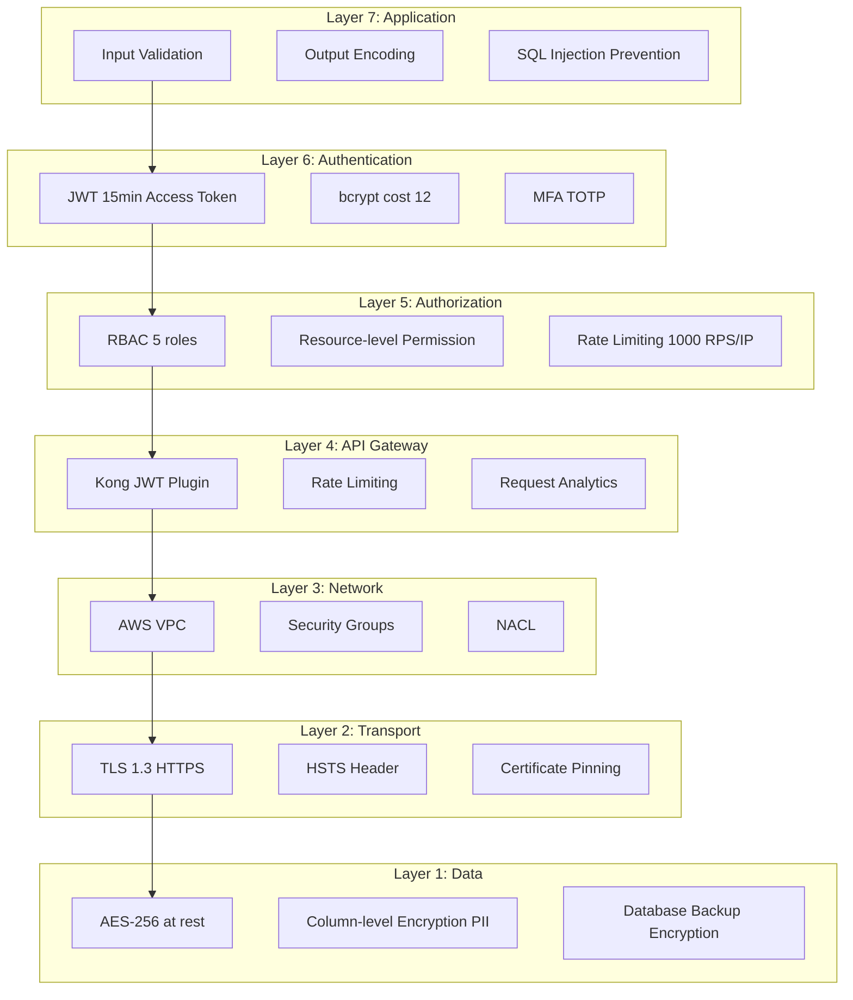

# 安全指南 (Security Guidelines)

> **Version**: 1.0  
> **Last Updated**: 2026-01-31  
> **Maintainer**: HyperHeroX Team  
> **Status**: ✅ Active  
> **Compliance**: OWASP Top 10, CISSP, PCI DSS Level 1

---

## 📋 概述 (Overview)

本文檔定義 HyperHeroX Skills 專案的安全標準與最佳實踐，涵蓋 OWASP Top 10, CISSP, PCI DSS Level 1, Defense in Depth, Zero Trust 等安全框架。所有程式碼與系統設計必須遵循本規範。

---

## 🎯 核心安全原則 (Core Security Principles)

| 原則 | 說明 | 實踐方式 |
|------|------|---------|
| **Defense in Depth** | 多層防禦 | 7 層防禦機制 (Application → Data) |
| **Zero Trust** | 零信任架構 | 每個請求都需驗證, 不信任內網 |
| **Least Privilege** | 最小權限原則 | RBAC (Role-Based Access Control) |
| **Secure by Default** | 預設安全 | 預設 HTTPS, 預設加密, 預設驗證 |
| **Fail Securely** | 安全失效 | 錯誤時拒絕存取, 不暴露敏感資訊 |

---

## 🛡️ Defense in Depth (7 Layers)

依據 **architecture.md (Security Architecture)**，系統採用 **7 層防禦機制**：



### Layer 7: Application Security (應用程式安全)

#### Input Validation (輸入驗證)
依據 **coding-standards.md (Security Coding Standards)**：

```typescript
// ✅ CORRECT - 使用 DTO + class-validator
import { IsEmail, IsString, MinLength, MaxLength, Matches } from 'class-validator';

class CreateUserDto {
  @IsString()
  @MinLength(2, { message: '姓名至少 2 個字元' })
  @MaxLength(50, { message: '姓名最多 50 個字元' })
  @Matches(/^[a-zA-Z0-9\u4e00-\u9fa5]+$/, { message: '姓名僅允許中英文與數字' })
  name: string;

  @IsEmail({}, { message: 'Email 格式錯誤' })
  email: string;

  @IsString()
  @MinLength(8, { message: '密碼至少 8 個字元' })
  @Matches(/^(?=.*[a-z])(?=.*[A-Z])(?=.*\d)(?=.*[@$!%*?&])[A-Za-z\d@$!%*?&]+$/, {
    message: '密碼必須包含大小寫字母、數字與特殊符號'
  })
  password: string;
}

// Controller 自動驗證
@Post('/users')
async createUser(@Body() createUserDto: CreateUserDto) {
  return this.userService.createUser(createUserDto);
}
```

**Validation Rules**:
| 欄位 | 規則 | 錯誤訊息 |
|------|------|---------|
| **Name** | 2-50 字元, 僅中英文數字 | "姓名至少 2 個字元", "姓名僅允許中英文與數字" |
| **Email** | RFC 5322 Email 格式 | "Email 格式錯誤" |
| **Password** | ≥8 字元, 大小寫+數字+特殊符號 | "密碼必須包含大小寫字母、數字與特殊符號" |

#### Output Encoding (輸出編碼)
```typescript
// ✅ CORRECT - Vue 自動 Escape
<template>
  <div>{{ userInput }}</div>  <!-- Vue 自動 escape -->
</template>

// ⚠️ CAUTION - v-html 需手動 Sanitize
<template>
  <div v-html="sanitizedHTML"></div>
</template>

<script setup>
import DOMPurify from 'dompurify';

const sanitizedHTML = DOMPurify.sanitize(userHTML);
</script>
```

#### SQL Injection Prevention (SQL Injection 防護)
依據 **coding-standards.md (Security Coding Standards)**：

```typescript
// ❌ BAD - 字串拼接 (SQL Injection 風險)
const query = `SELECT * FROM users WHERE email = '${email}'`;

// ✅ CORRECT - Parameterized Query
const query = 'SELECT * FROM users WHERE email = $1';
const result = await db.query(query, [email]);
```

```python
# ❌ BAD - Python 字串拼接
query = f"SELECT * FROM users WHERE email = '{email}'"

# ✅ CORRECT - Python Parameterized Query
query = "SELECT * FROM users WHERE email = %s"
cursor.execute(query, (email,))
```

---

### Layer 6: Authentication (身份驗證)

#### JWT 策略 (JWT Strategy)
依據 **AGENTS.md Section 6 (Security Guardrails)** 與 **coding-standards.md**：

```typescript
// ✅ CORRECT - JWT Secret ≥ 32 字元
const JWT_SECRET = process.env.JWT_SECRET;

if (!JWT_SECRET || JWT_SECRET.length < 32) {
  throw new Error('JWT_SECRET must be at least 32 characters');
}

// ✅ CORRECT - JWT 過期時間
const JWT_ACCESS_EXPIRY = '15m';   // Access Token: 15 minutes
const JWT_REFRESH_EXPIRY = '30d';  // Refresh Token: 30 days

// 生成 Access Token
function generateAccessToken(userId: string): string {
  return jwt.sign({ userId, type: 'access' }, JWT_SECRET, { 
    expiresIn: JWT_ACCESS_EXPIRY,
    issuer: 'hyperherox',
    audience: 'api.hyperherox.com'
  });
}

// 生成 Refresh Token
function generateRefreshToken(userId: string): string {
  return jwt.sign({ userId, type: 'refresh' }, JWT_SECRET, { 
    expiresIn: JWT_REFRESH_EXPIRY,
    issuer: 'hyperherox',
    audience: 'api.hyperherox.com'
  });
}

// 驗證 Token
function verifyToken(token: string): { userId: string; type: string } {
  try {
    return jwt.verify(token, JWT_SECRET) as { userId: string; type: string };
  } catch (error) {
    if (error instanceof jwt.TokenExpiredError) {
      throw new Error('Token expired');
    }
    throw new Error('Invalid token');
  }
}
```

**JWT Token 規範**:
| 項目 | 規範 | 備註 |
|------|------|------|
| **Secret 長度** | ≥ 32 字元 | AGENTS.md 強制要求 |
| **Access Token 過期** | 15 分鐘 | 短過期時間降低風險 |
| **Refresh Token 過期** | 30 天 | 避免頻繁登入 |
| **Issuer** | `hyperherox` | 發行者標識 |
| **Audience** | `api.hyperherox.com` | 接收者標識 |

#### Password Hashing (密碼雜湊)
依據 **AGENTS.md Section 6 (Security Guardrails)** 與 **coding-standards.md**：

```typescript
// ✅ CORRECT - bcrypt cost 12 (AGENTS.md 強制要求)
import bcrypt from 'bcrypt';

const SALT_ROUNDS = 12;  // AGENTS.md 強制要求, 禁止使用 sha256

async function hashPassword(password: string): Promise<string> {
  return bcrypt.hash(password, SALT_ROUNDS);
}

async function verifyPassword(password: string, hash: string): Promise<boolean> {
  return bcrypt.compare(password, hash);
}
```

```python
# ✅ CORRECT - Python bcrypt cost 12
import bcrypt

SALT_ROUNDS = 12

def hash_password(password: str) -> str:
    return bcrypt.hashpw(password.encode('utf-8'), bcrypt.gensalt(SALT_ROUNDS)).decode('utf-8')

def verify_password(password: str, hash: str) -> bool:
    return bcrypt.checkpw(password.encode('utf-8'), hash.encode('utf-8'))
```

**Password Hashing 規範**:
| 項目 | 規範 | 備註 |
|------|------|------|
| **演算法** | bcrypt or argon2 | AGENTS.md 強制要求 |
| **Cost / Rounds** | 12 | AGENTS.md 強制要求 |
| **禁止使用** | sha256, md5, sha1 | 快速雜湊不安全 |

#### Multi-Factor Authentication (MFA, 多因素驗證)
```typescript
// ✅ CORRECT - TOTP (Time-based One-Time Password)
import * as speakeasy from 'speakeasy';
import * as QRCode from 'qrcode';

// 1. 生成 MFA Secret
async function generateMFASecret(userId: string): Promise<{ secret: string; qrCode: string }> {
  const secret = speakeasy.generateSecret({
    name: `HyperHeroX (${userId})`,
    issuer: 'HyperHeroX',
  });
  
  const qrCode = await QRCode.toDataURL(secret.otpauth_url!);
  
  return { 
    secret: secret.base32,  // 儲存到資料庫
    qrCode  // 顯示 QR Code 給使用者掃描
  };
}

// 2. 驗證 TOTP
function verifyTOTP(secret: string, token: string): boolean {
  return speakeasy.totp.verify({
    secret,
    encoding: 'base32',
    token,
    window: 2,  // 允許前後 2 個時間窗口 (60s)
  });
}

// 3. 登入流程 (含 MFA)
async function loginWithMFA(email: string, password: string, totpToken: string) {
  // Step 1: 驗證密碼
  const user = await userRepository.findByEmail(email);
  if (!user || !(await verifyPassword(password, user.passwordHash))) {
    throw new Error('Invalid credentials');
  }
  
  // Step 2: 驗證 TOTP
  if (!verifyTOTP(user.mfaSecret, totpToken)) {
    throw new Error('Invalid MFA token');
  }
  
  // Step 3: 生成 JWT
  return {
    accessToken: generateAccessToken(user.id),
    refreshToken: generateRefreshToken(user.id),
  };
}
```

---

### Layer 5: Authorization (授權)

#### RBAC (Role-Based Access Control)
```typescript
// ✅ CORRECT - RBAC 5 Roles
enum UserRole {
  ADMIN = 'admin',      // 系統管理員 (全權限)
  USER = 'user',        // 一般使用者 (瀏覽, 下單)
  VENDOR = 'vendor',    // 供應商 (商品管理, 庫存)
  CS = 'cs',            // 客服 (查看訂單, 回覆問題)
  GUEST = 'guest',      // 訪客 (僅瀏覽)
}

// Permission Definition
const permissions = {
  [UserRole.ADMIN]: ['*'],  // 全權限
  [UserRole.USER]: ['product:read', 'order:create', 'order:read'],
  [UserRole.VENDOR]: ['product:*', 'inventory:*'],
  [UserRole.CS]: ['order:read', 'ticket:*'],
  [UserRole.GUEST]: ['product:read'],
};

// 權限檢查 Guard
@Injectable()
export class PermissionGuard implements CanActivate {
  canActivate(context: ExecutionContext): boolean {
    const request = context.switchToHttp().getRequest();
    const user = request.user;  // 從 JWT 解析
    const requiredPermission = this.reflector.get<string>('permission', context.getHandler());
    
    // 檢查是否有權限
    const userPermissions = permissions[user.role];
    return userPermissions.includes('*') || userPermissions.includes(requiredPermission);
  }
}

// 使用範例
@Post('/products')
@RequirePermission('product:create')
async createProduct(@Body() productDto: CreateProductDto) {
  return this.productService.createProduct(productDto);
}
```

#### Resource-level Permission (資源級權限)
```typescript
// ✅ CORRECT - 檢查資源擁有者
@Get('/orders/:id')
async getOrder(@Param('id') orderId: string, @User() user: UserInfo) {
  const order = await this.orderRepository.findById(orderId);
  
  // 資源級權限檢查
  if (user.role === UserRole.USER && order.userId !== user.id) {
    throw new ForbiddenException('You can only view your own orders');
  }
  
  return order;
}
```

#### Rate Limiting (速率限制)
依據 **architecture.md (Auto Scaling Rules)**：

```typescript
// ✅ CORRECT - Kong Rate Limiting
// kong.yml
plugins:
  - name: rate-limiting
    config:
      minute: 1000   # 每 IP 每分鐘 1000 次請求
      hour: 50000    # 每 IP 每小時 50000 次請求
      policy: local
      fault_tolerant: true

// ✅ CORRECT - Application-level Rate Limiting (備用)
import rateLimit from 'express-rate-limit';

const limiter = rateLimit({
  windowMs: 60 * 1000,  // 1 minute
  max: 1000,             // 1000 requests per minute per IP
  message: 'Too many requests, please try again later',
});

app.use('/api', limiter);
```

---

### Layer 4: API Gateway Security

#### Kong JWT Plugin
```yaml
# kong.yml
services:
  - name: user-service
    url: http://user-service:3000
    routes:
      - name: user-route
        paths:
          - /api/users
    plugins:
      - name: jwt
        config:
          secret_is_base64: false
          claims_to_verify:
            - exp  # 驗證過期時間
            - iss  # 驗證發行者
            - aud  # 驗證接收者
      - name: rate-limiting
        config:
          minute: 1000
      - name: request-size-limiting
        config:
          allowed_payload_size: 10  # 10 MB
```

---

### Layer 3: Network Security

#### AWS VPC Configuration
```terraform
# vpc.tf
resource "aws_vpc" "main" {
  cidr_block = "10.0.0.0/16"
  enable_dns_support = true
  enable_dns_hostnames = true
  
  tags = {
    Name = "hyperherox-vpc"
  }
}

# Public Subnet (API Gateway, Load Balancer)
resource "aws_subnet" "public" {
  vpc_id = aws_vpc.main.id
  cidr_block = "10.0.1.0/24"
  availability_zone = "ap-northeast-1a"
  map_public_ip_on_launch = true
}

# Private Subnet (Microservices, Database)
resource "aws_subnet" "private" {
  vpc_id = aws_vpc.main.id
  cidr_block = "10.0.2.0/24"
  availability_zone = "ap-northeast-1a"
  map_public_ip_on_launch = false
}

# Security Group (API Gateway)
resource "aws_security_group" "api_gateway" {
  vpc_id = aws_vpc.main.id
  
  ingress {
    from_port = 443
    to_port = 443
    protocol = "tcp"
    cidr_blocks = ["0.0.0.0/0"]  # HTTPS from Internet
  }
  
  egress {
    from_port = 0
    to_port = 0
    protocol = "-1"
    cidr_blocks = ["0.0.0.0/0"]
  }
}

# Security Group (Microservices)
resource "aws_security_group" "microservices" {
  vpc_id = aws_vpc.main.id
  
  ingress {
    from_port = 3000
    to_port = 3000
    protocol = "tcp"
    security_groups = [aws_security_group.api_gateway.id]  # 僅允許 API Gateway
  }
  
  egress {
    from_port = 0
    to_port = 0
    protocol = "-1"
    cidr_blocks = ["0.0.0.0/0"]
  }
}
```

---

### Layer 2: Transport Security

#### TLS 1.3 Configuration
```nginx
# nginx.conf
server {
    listen 443 ssl http2;
    server_name api.hyperherox.com;
    
    # TLS 1.3 Only
    ssl_protocols TLSv1.3;
    
    # Certificate
    ssl_certificate /etc/nginx/ssl/cert.pem;
    ssl_certificate_key /etc/nginx/ssl/key.pem;
    
    # HSTS Header (HTTP Strict Transport Security)
    add_header Strict-Transport-Security "max-age=31536000; includeSubDomains; preload" always;
    
    # Security Headers
    add_header X-Frame-Options "DENY" always;
    add_header X-Content-Type-Options "nosniff" always;
    add_header X-XSS-Protection "1; mode=block" always;
    add_header Content-Security-Policy "default-src 'self'; script-src 'self' 'unsafe-inline'; style-src 'self' 'unsafe-inline';" always;
    
    location / {
        proxy_pass http://api-gateway:8000;
    }
}
```

---

### Layer 1: Data Security

#### Encryption at Rest (靜態加密)
```typescript
// ✅ CORRECT - AES-256 Encryption
import crypto from 'crypto';

const ENCRYPTION_KEY = Buffer.from(process.env.ENCRYPTION_KEY!, 'hex');  // 32 bytes
const ALGORITHM = 'aes-256-gcm';

function encrypt(text: string): { encrypted: string; iv: string; tag: string } {
  const iv = crypto.randomBytes(16);
  const cipher = crypto.createCipheriv(ALGORITHM, ENCRYPTION_KEY, iv);
  
  let encrypted = cipher.update(text, 'utf8', 'hex');
  encrypted += cipher.final('hex');
  
  const tag = cipher.getAuthTag();
  
  return {
    encrypted,
    iv: iv.toString('hex'),
    tag: tag.toString('hex'),
  };
}

function decrypt(encrypted: string, iv: string, tag: string): string {
  const decipher = crypto.createDecipheriv(
    ALGORITHM,
    ENCRYPTION_KEY,
    Buffer.from(iv, 'hex')
  );
  
  decipher.setAuthTag(Buffer.from(tag, 'hex'));
  
  let decrypted = decipher.update(encrypted, 'hex', 'utf8');
  decrypted += decipher.final('utf8');
  
  return decrypted;
}

// PII 欄位加密
async function createUser(userDto: CreateUserDto) {
  const { name, email, phone } = userDto;
  
  // 加密 PII 欄位
  const encryptedPhone = encrypt(phone);
  
  return userRepository.create({
    name,  // Name 不加密 (可搜尋)
    email,  // Email 不加密 (可搜尋)
    phone_encrypted: encryptedPhone.encrypted,
    phone_iv: encryptedPhone.iv,
    phone_tag: encryptedPhone.tag,
  });
}
```

---

## 🔒 OWASP Top 10 Mitigation

依據 **architecture.md (OWASP Top 10 Mitigation)**：

| OWASP Risk | 威脅 | 緩解措施 | 實作位置 |
|-----------|------|---------|---------|
| **#1 Injection** | SQL Injection, NoSQL Injection, Command Injection | ✅ Parameterized Queries (Prepared Statements) | All Services (PostgreSQL, MongoDB) |
| **#2 Broken Authentication** | 弱密碼, Session Hijacking, Brute Force | ✅ JWT (15min) + bcrypt (cost 12) + MFA (TOTP) | User Service |
| **#3 Sensitive Data Exposure** | 明文儲存, HTTP 傳輸 | ✅ AES-256 (at rest) + TLS 1.3 (in transit) | All Services |
| **#4 XML External Entities (XXE)** | XML 解析漏洞 | ✅ 禁用外部實體, 使用 JSON | API Gateway (Kong) |
| **#5 Broken Access Control** | 越權存取, IDOR | ✅ RBAC (5 roles) + Resource-level permissions | User Service + All Services |
| **#6 Security Misconfiguration** | 預設密碼, 不必要服務 | ✅ AWS Secrets Manager, Security Hardening | All Services (Infrastructure) |
| **#7 XSS** | Reflected XSS, Stored XSS, DOM-based XSS | ✅ CSP Header + Output Encoding (Vue 內建) | Web App (Nuxt) |
| **#8 Insecure Deserialization** | Remote Code Execution | ✅ JSON Schema Validation (Ajv) | API Gateway (Kong) |
| **#9 Using Components with Known Vulnerabilities** | 過時套件 | ✅ Snyk Dependency Scan (每週) | CI/CD Pipeline |
| **#10 Insufficient Logging** | 無法追蹤攻擊 | ✅ Centralized Logging (Elasticsearch) + Audit Trail | All Services |

---

## 💳 PCI DSS Level 1 Compliance

依據 **architecture.md (PCI DSS Level 1 Compliance)**，**Payment Service 必須符合 PCI DSS Level 1**：

| Requirement | 措施 | 驗證方式 | 負責服務 |
|-------------|------|---------|---------|
| **Req 1**: 防火牆保護 | AWS VPC, Security Groups, NACL | ✅ AWS Config Rules | Infrastructure |
| **Req 2**: 不使用預設密碼 | AWS Secrets Manager, IAM 強制密碼策略 (12+ 字元) | ✅ IAM Policy Audit | Infrastructure |
| **Req 3**: 保護儲存的持卡人資料 | AES-256, 卡號 Tokenization (Stripe Vault) | ✅ KMS Audit Log | Payment Service |
| **Req 4**: 傳輸加密 | TLS 1.3, HTTPS only | ✅ ALB Listener Policy | Infrastructure |
| **Req 6**: 開發安全應用程式 | OWASP Top 10, Code Review, SAST/DAST | ✅ Snyk, OWASP ZAP | CI/CD Pipeline |
| **Req 8**: 識別與驗證 | MFA (TOTP), JWT 15min expiry | ✅ User Service Log | User Service |
| **Req 10**: 追蹤與監控 | AWS CloudWatch Logs, Audit Trail (每筆交易) | ✅ SIEM (Datadog) | All Services |
| **Req 11**: 定期測試安全性 | Penetration Test (每季), Vulnerability Scan (每週) | ✅ External Auditor | Security Team |
| **Req 12**: 維護資安政策 | Security Policy, Incident Response Plan | ✅ Security Team Review | Security Team |

---

## 🚫 禁止使用技術 (Forbidden Technologies)

依據 **AGENTS.md Section 5.2, 6** 與 **tech-stack.md (Forbidden Technologies)**：

| 技術 | 原因 | 替代方案 | 來源 |
|------|------|---------|------|
| **sha256 (密碼雜湊)** | ❌ 快速雜湊不安全, 易於 GPU 爆破 | ✅ bcrypt (cost 12) / argon2 | AGENTS.md Section 6 |
| **chrome.storage.sync (API Key)** | ❌ API Key 同步風險, 可能外洩 | ✅ chrome.storage.local + AES-256 Encryption | AGENTS.md Section 6 |
| **eval / exec / system** | ❌ Code Injection 風險, RCE (Remote Code Execution) | ✅ 靜態分析 + 參數化查詢 + 白名單 | AGENTS.md Section 5.2 |
| **單純 HTTP (無 HTTPS)** | ❌ 明文傳輸, MITM 攻擊 | ✅ TLS 1.3 (HTTPS only) | tech-stack.md |
| **任何不受信任輸入直接拼入 SQL** | ❌ SQL Injection | ✅ Parameterized Query | coding-standards.md |
| **弱密碼策略 (<8 字元)** | ❌ Brute Force 攻擊 | ✅ ≥8 字元 + 大小寫 + 數字 + 特殊符號 | coding-standards.md |

---

## 🔍 Security Testing (安全測試)

依據 **testing-standards.md (Security Test)**：

### OWASP ZAP Automated Security Scan
```bash
# 執行 OWASP ZAP 基線掃描
docker run -v $(pwd):/zap/wrk/:rw -t owasp/zap2docker-stable \
  zap-baseline.py -t https://linebotrag-staging.up.railway.app -r zap-report.html

# 執行 OWASP ZAP 完整掃描 (耗時較長)
docker run -v $(pwd):/zap/wrk/:rw -t owasp/zap2docker-stable \
  zap-full-scan.py -t https://linebotrag-staging.up.railway.app -r zap-full-report.html
```

### Snyk Dependency Scan
```bash
# 執行 Snyk 依賴掃描
snyk test --all-projects --severity-threshold=high

# 執行 Snyk Docker Image 掃描
snyk container test hyperherox/api:latest
```

### Penetration Testing (滲透測試)
| 測試項目 | 頻率 | 工具 | 負責人 |
|---------|------|------|-------|
| **Vulnerability Scan** | 每週 | Snyk, OWASP ZAP | CI/CD Pipeline |
| **Penetration Test** | 每季 | External Security Auditor | Security Team |
| **Red Team Exercise** | 每半年 | Internal Security Team | Security Team |

---

## 📊 Security Monitoring (安全監控)

### Security Metrics (安全指標)
| 指標 | 目標值 | 監控工具 | Alert 閾值 |
|------|-------|---------|----------|
| **Failed Login Attempts** | < 5 per user per hour | Datadog | > 10 per user per hour |
| **Suspicious API Requests** | < 0.1% | Kong Analytics | > 1% per hour |
| **SQL Injection Attempts** | 0 | AWS WAF, Kong | > 0 per hour |
| **XSS Attempts** | 0 | AWS WAF, Kong | > 0 per hour |
| **Brute Force Attempts** | < 10 per IP per hour | Kong Rate Limiting | > 50 per IP per hour |
| **Certificate Expiry** | > 30 days | AWS Certificate Manager | < 30 days |

### Security Alerts (安全告警)
```yaml
# datadog-alerts.yml
- name: "Failed Login Spike"
  query: "avg(last_5m):sum:auth.login.failed{*} > 100"
  message: "Failed login attempts > 100 in last 5 minutes"
  notify:
    - "@security-team"
    - "@on-call"

- name: "SQL Injection Detected"
  query: "avg(last_1m):sum:waf.sql_injection{*} > 0"
  message: "SQL Injection attempt detected"
  notify:
    - "@security-team"
    - "@on-call"
    - "pagerduty-critical"
```

---

## 🚨 Incident Response (事件回應)

### Security Incident Severity (事件嚴重性)
| 嚴重性 | 定義 | 範例 | 回應時間 (RTO) |
|-------|------|------|---------------|
| **Critical** | 資料外洩, 系統全面癱瘓 | Database 被駭, 所有服務無法存取 | < 15 分鐘 |
| **High** | 部分服務癱瘓, 敏感資料外洩 | Payment Service 無法使用, PII 資料外洩 | < 1 小時 |
| **Medium** | 服務效能降低, 非敏感資料外洩 | API 回應變慢, 非 PII 資料外洩 | < 4 小時 |
| **Low** | 輕微異常, 無資料外洩 | 單一使用者無法登入 | < 24 小時 |

### Incident Response Plan (事件回應計畫)
1. **Detect** (偵測): 安全監控系統偵測異常
2. **Alert** (告警): 自動告警到 Security Team + On-call Engineer
3. **Contain** (隔離): 隔離受影響系統 (Block IP, Disable Service)
4. **Investigate** (調查): 分析日誌, 追蹤攻擊來源
5. **Remediate** (修復): 修復漏洞, 恢復服務
6. **Post-Mortem** (事後檢討): 撰寫事件報告, 改善流程

---

## 📚 參考文件 (References)

### 內部文件
- **architecture.md**: Security Architecture (Defense in Depth, OWASP Top 10, PCI DSS)
- **coding-standards.md**: Security Coding Standards (Input Validation, Password Hashing, SQL Injection Prevention)
- **testing-standards.md**: Security Test (OWASP ZAP, Snyk, Penetration Testing)
- **AGENTS.md**: Section 5.2 (程式碼品質禁止事項), Section 6 (安全防護規範)
- **tech-stack.md**: Forbidden Technologies

### 外部標準
- **OWASP Top 10**: https://owasp.org/www-project-top-ten/
- **PCI DSS v4.0**: https://www.pcisecuritystandards.org/
- **CISSP Domains**: https://www.isc2.org/Certifications/CISSP/CISSP-Domains
- **NIST Cybersecurity Framework**: https://www.nist.gov/cyberframework
- **CIS Benchmarks**: https://www.cisecurity.org/cis-benchmarks

---

## 🔄 版本歷史 (Version History)

| 版本 | 日期 | 變更內容 | 作者 |
|------|------|---------|------|
| 1.0 | 2026-01-31 | 初版建立 | AI Agent (Copilot) |

---

## ✅ 結論 (Conclusion)

本安全指南涵蓋 Defense in Depth (7 Layers), OWASP Top 10, CISSP, PCI DSS Level 1 等所有層面，所有程式碼與系統設計必須遵循本規範。

**關鍵安全措施**:
1. ✅ **Defense in Depth** (7 層防禦: Application → Data)
2. ✅ **bcrypt cost 12** (AGENTS.md 強制要求, 禁止 sha256)
3. ✅ **JWT Secret ≥ 32 字元** (AGENTS.md 強制要求)
4. ✅ **Parameterized Query** (防止 SQL Injection)
5. ✅ **OWASP Top 10 Mitigation** (#1-#10 全覆蓋)
6. ✅ **PCI DSS Level 1 Compliance** (Payment Service, Req 1-12)
7. ✅ **Security Testing** (OWASP ZAP, Snyk, Penetration Test)

---

**維護責任**: HyperHeroX Security Team  
**更新頻率**: 每季度檢視 (Q1, Q2, Q3, Q4)  
**最後更新**: 2026-01-31

**Compliance Status**: ✅ OWASP Top 10, ✅ CISSP, ✅ PCI DSS Level 1
