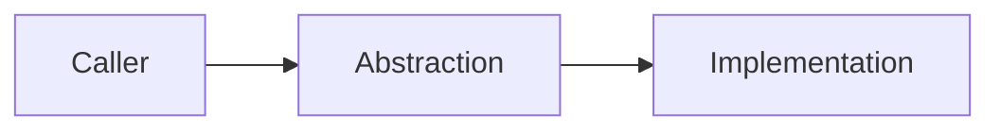

# AI Agent 設計模式決策紀錄範本（Pattern Decision Record, PDR）

> 建議儲存位置：`/docs/design-patterns.md`；重大或跨模組決策另建立 `/docs/adr/ADR-xxxx-<topic>.md`。  
> 本範本用於證明「先辨識問題，再選擇模式」，而不是為套用模式而建立問題。

## 0. 基本資料

| 欄位 | 內容 |
|---|---|
| PDR ID | `PDR-YYYY-NNN` |
| 狀態 | Proposed／Accepted／Deprecated／Superseded／Rejected |
| 系統／模組 |  |
| Requirement／Issue |  |
| Owner |  |
| Code Owner／Reviewer |  |
| 建立／更新日期 |  |
| 適用剖面 | CORE／WEB／DATA／MT／AI／AGENT／HA／TW-GOV |
| Assurance Level | A1／A2／A3 |
| 相關 ADR／PR |  |

## 1. 問題與真實變化點

- 目前具體問題：
- 造成問題的責任、耦合或重複：
- 預期會變動的維度：
- 不會變動或明確排除的範圍：
- 量化或可觀察證據：

## 2. 必要約束

| 面向 | 約束／目標 |
|---|---|
| 功能與業務不變條件 |  |
| 身分、授權與 Tenant |  |
| 資料分類與隱私 |  |
| 交易、冪等與一致性 |  |
| 併發、生命週期與 Thread Safety |  |
| 效能、容量與資源上限 |  |
| Timeout、取消、重試與失敗 |  |
| API／Schema／事件相容性 |  |
| 可觀測性與稽核 |  |
| Migration／Rollback |  |

## 3. 既有方案盤點

- Repository 內相似實作：
- 可直接重用的函式／元件／框架能力：
- 現有 Pattern／ADR：
- 為何無法僅以簡單函式、組合或現有元件完成：

## 4. 候選方案比較

> 至少包含「維持簡單設計」；重大變更應比較兩個以上候選模式。

| 候選 | 適配的問題／變化點 | 優點 | 成本與複雜度 | 資安／資料風險 | 測試難度 | 決策 |
|---|---|---|---|---|---|---|
| 維持簡單設計 |  |  |  |  |  | 採用／拒絕 |
| `<GoF Pattern A>` |  |  |  |  |  | 採用／拒絕 |
| `<GoF Pattern B>` |  |  |  |  |  | 採用／拒絕 |

## 5. 決策

- **決策**：採用 `<Pattern>`／不新增模式
- **理由**：
- **被拒絕方案與原因**：
- **開始適用版本／日期**：
- **重新評估條件**：

## 6. 模式角色與程式對映

| GoF 角色／責任 | 實際類別、函式、模組或服務 | Owner | 生命週期 | 可變性／Thread Safety |
|---|---|---|---|---|
|  |  |  |  |  |

## 7. 依賴與互動

- 依賴方向：
- 同步／非同步邊界：
- 交易邊界：
- 外部服務與第三方：
- 事件／Command／State 版本：

## 8. 模式特有風險檢查

- [ ] 無全域可變 Singleton、Service Locator 或隱藏依賴。
- [ ] Factory／Strategy／Command／State／Interpreter 僅由允許清單選擇。
- [ ] Builder 未串接原始 SQL、Shell、HTML 或其他可執行字串。
- [ ] Prototype 已定義 Deep／Shallow Copy，未複製 Secret、Token、Handle 或跨租戶狀態。
- [ ] Proxy／Decorator／Facade／Mediator 未取代權威授權與輸入驗證。
- [ ] Composite／Interpreter／Visitor／責任鏈具深度、步數、鏈長與資源上限。
- [ ] Observer／Command／事件具取消、解除訂閱、冪等、Backpressure 與失敗隔離。
- [ ] Template Method 未形成深層繼承或可繞過不變條件的 Hook。
- [ ] Flyweight 共享狀態不可變，且不含 User／Tenant／Secret。
- [ ] Facade／Mediator 未演變為 God Object。

## 9. 測試與驗證

| 測試類型 | 測試案例／命令 | 預期證據 |
|---|---|---|
| 正常流程 |  |  |
| 替代實作／策略 |  |  |
| 不合法組合／狀態 |  |  |
| 失敗、Timeout、取消 |  |  |
| 併發／Race／重複執行 |  |  |
| 授權／Tenant 負面測試 |  |  |
| 容量／深度／資源上限 |  |  |
| Contract／相容性 |  |  |

## 10. Migration、發布與回復

- 導入步驟：
- 舊實作共存方式：
- Feature Flag／Canary：
- 資料／事件 Migration：
- Rollback／Roll-forward：
- 部署後觀察指標與門檻：

## 11. AI 參與揭露

- AI 工具／模型：
- AI 參與範圍：
- AI 提出的候選模式：
- 人類修改與決策：
- 未驗證假設：

## 12. 審查與核准

| 角色 | 姓名 | 結論 | 日期 |
|---|---|---|---|
| 開發／架構 |  | Approve／Reject |  |
| 資安／隱私（適用時） |  | Approve／Reject |  |
| Data／DB（適用時） |  | Approve／Reject |  |
| SRE／維運（適用時） |  | Approve／Reject |  |
| Product／Domain Owner |  | Approve／Reject |  |

---

## GoF 23 種模式快速索引

| 類別 | 模式 |
|---|---|
| 建立型 | Singleton、Factory Method、Abstract Factory、Builder、Prototype |
| 結構型 | Adapter、Bridge、Composite、Decorator、Facade、Flyweight、Proxy |
| 行為型 | Chain of Responsibility、Command、Interpreter、Iterator、Mediator、Memento、Observer、State、Strategy、Template Method、Visitor |
