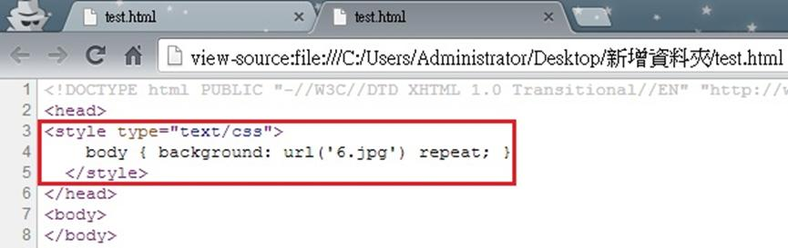

# CS1110113E 裝飾性圖片均透過CSS來置入

- **稽核評量碼**：CS1110113E
- **對應成功準則**：1.1.1
- **對應認證等級**：A
- **對應國際技術碼**：C9
- **類別**：CSS
- **訊息**：裝飾性圖片均透過CSS來置入
- **英文訊息**：C9: Using CSS to include decorative images

## 規則說明

任何在HTML或XHTML的網頁內，任何裝飾性的圖片或是背景圖片都必須透過CSS來置入。

軟體檢測無法判斷圖片用途。

## 檢測說明

使用Google Chrome「檢視原始碼」顯示連結 (按下右鍵→檢視原始碼)。

檢查裝飾性圖片是否有用css方式置入。

## 說明

無

## 範例

**圖片說明：** Google Chrome 瀏覽器開啟本機 HTML 檔案「test.html」的截圖，頁面背景顯示「WishWing Follow your Dream!」裝飾性插圖（小熊坐在樹枝上的卡通圖案），作為頁面的背景圖片。畫面右側彈出滑鼠右鍵選單，「檢視網頁原始碼」選項以藍色反白標示，示範透過右鍵選單查看原始碼，確認裝飾性圖片是否透過 CSS 方式置入。

**圖片說明：** 瀏覽器以「原始碼」模式顯示「test.html」的 HTML 程式碼截圖，位址列顯示 view-source 路徑。以紅框標示第3至5行的 CSS 樣式宣告：``，示範裝飾性背景圖片「6.jpg」透過 CSS 的 `background` 屬性置入 `body` 元素，而非直接在 HTML 中使用 `` 標籤，使輔助科技能正確忽略此裝飾性圖片。