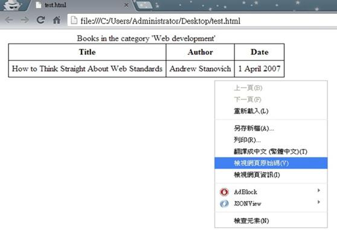
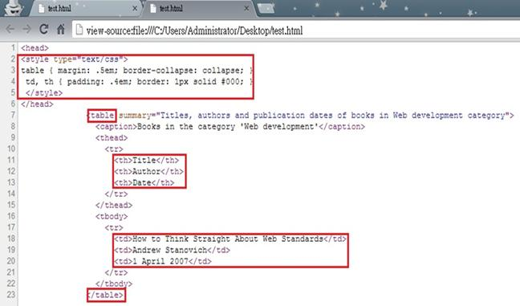

# CS1110114E 使用CSS方塊模型來處理版面設計，不要用佔位圖片

- **稽核評量碼**：CS1110114E
- **對應成功準則**：1.1.1
- **對應認證等級**：A
- **對應國際技術碼**：C18
- **類別**：CSS
- **訊息**：使用CSS方塊模型來處理版面設計，不要用佔位圖片
- **英文訊息**：C18: Using CSS margin and padding rules instead of spacer images for layout design

## 規則說明

任何在HTML或XHTML的網頁必須使用CSS方塊模型來設計版面，不要用佔位圖片來控制物件的間距。

## 檢測說明

使用Google Chrome「檢視原始碼」顯示連結 (按下右鍵→檢視原始碼)

檢查項目內容是否有用CSS方塊模型來處理版面

## 說明

無

## 範例

**圖片說明：** Google Chrome 瀏覽器開啟本機 HTML 檔案「test.html」的截圖，頁面顯示一個書籍資料表格，標題為「Books in the category 'Web development'」，表格包含「Title」、「Author」、「Date」三欄，資料列顯示「How to Think Straight About Web Standards」、「Andrew Stanovich」、「1 April 2007」。畫面右側彈出滑鼠右鍵選單，「檢視網頁原始碼」選項以藍色反白標示，示範透過右鍵選單查看原始碼，確認版面設計是否使用 CSS 方塊模型而非佔位圖片。

**圖片說明：** 瀏覽器以「原始碼」模式顯示「test.html」的 HTML 程式碼截圖，位址列顯示 view-source 路徑。以紅框標示多處程式碼：第2至5行的 CSS 樣式宣告（`table { margin: .5em; border-collapse: collapse; }` 和 `td, th { padding: .4em; border: 1px solid #000; }`）使用 CSS margin 與 padding 屬性控制表格間距；第7行 `<table>` 標籤、第11-13行 `<th>` 標題欄、第18-20行 `<td>` 資料欄、第22行 `</table>` 結束標籤均以紅框標示。示範使用 CSS 方塊模型（margin、padding、border）來控制版面間距，取代以往使用佔位圖片（spacer images）的做法，符合無障礙設計規範。