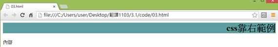
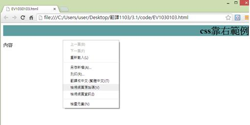

# CS1130103E 文字的視覺呈現均以CSS來控制

- **稽核評量碼**：CS1130103E
- **對應成功準則**：1.3.1
- **對應認證等級**：A
- **對應國際技術碼**：C22
- **類別**：CSS
- **訊息**：文字的視覺呈現均以CSS來控制
- **英文訊息**：C22: Using CSS to control visual presentation of text

## 規則說明

需要用到CSS樣式表來改變文字呈現方式時，且皆須遵守此指引。

## 檢測說明

使用Google Chrome瀏覽器開啟檔案，確認是否有受CSS樣式表影響文字視覺呈現。(此範例顯示文字靠右及顯示背景色)

點選右鍵檢視網頁原始碼。

程式碼中我們可以看到以CSS樣式表控制文字視覺呈現。

## 說明

無

## 範例

**圖片說明：** 展示網頁頁面，頁面上方顯示標題「CSS左右範例」在綠色背景上，文字「內容」和「內容」以靠右對齐的方式呈現，背景為綠色。此圖展示使用CSS樣式表控制文字的視覺呈現（包括對齐方式和背景顏色），而不是依賴HTML層級的視覺效果。

**圖片說明：** 展示右鍵內容菜單。菜單選項包括「上一頁(B)」、「下一頁(F)」、「重新載入(L)」、「另存新頁(A)...」、「另存(R)...」、「書籤←=→ (星標=圖)(T)」、「檢視網頁原始碼(V)」、「檢視網頁資訊(I)」、「檢查元素(N)」等。此圖說明使用者可通過右鍵檢查網頁原始碼，以驗證CSS樣式表被正確應用於文字呈現。
