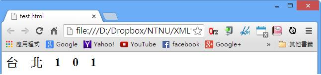
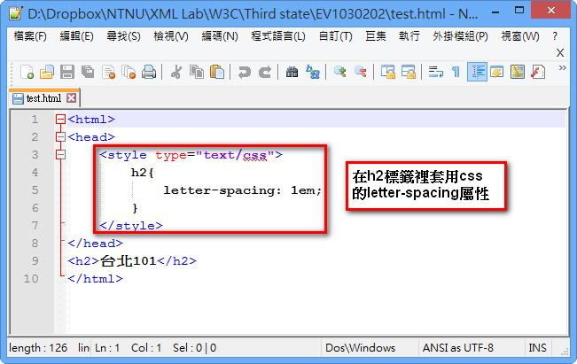

# CS1130202E 使用CSS來控制字詞內的字母間距

- **稽核評量碼**：CS1130202E
- **對應成功準則**：1.3.2
- **對應認證等級**：A
- **對應國際技術碼**：C8
- **類別**：CSS
- **訊息**：使用CSS來控制字詞內的字母間距
- **英文訊息**：C8: Using CSS letter-spacing to control spacing within a word

## 規則說明

任何使用CSS的網頁，都要遵守此指引。

系統無法找出每個字元之間呈現不正常間格的字串

## 檢測說明

找出每個字元之間呈現不正常間格的字串。

檢查該字串是否使用CSS的letter-spacing屬性改變文字或字元間的間距。

## 說明

無

## 範例

**圖片說明：** 展示網頁呈現效果。頁面顯示「台 北 1 0 1」文字，其中每個字符之間都有明顯的間距。這是通過CSS的letter-spacing屬性在字符之間插入額外空間實現的。此圖展示字母間距增加後的視覺效果。

**圖片說明：** 展示HTML代碼編輯器視圖。代碼包含：第1行「<html>」，第2行「<head>」，第3-7行「<style type="text/css">」標籤內的CSS規則，其中h2選擇器包含「letter-spacing: 1em;」屬性（被紅色方框標示）和右側標籤「此h2標籤套用CSS的letter-spacing屬性」。第9行「<h2>台北101</h2>」是應用此CSS規則的標題。此代碼結構展示如何使用CSS的letter-spacing屬性來控制字符之間的間距，而不是通過在HTML中插入空格或特殊字符。這種方式更加語義化和易於維護。

