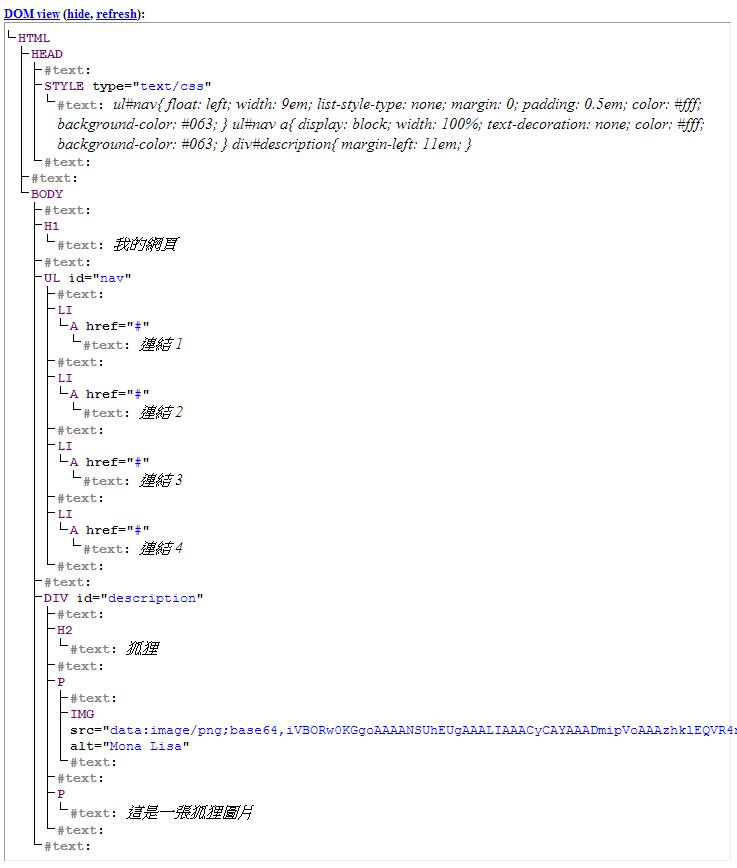
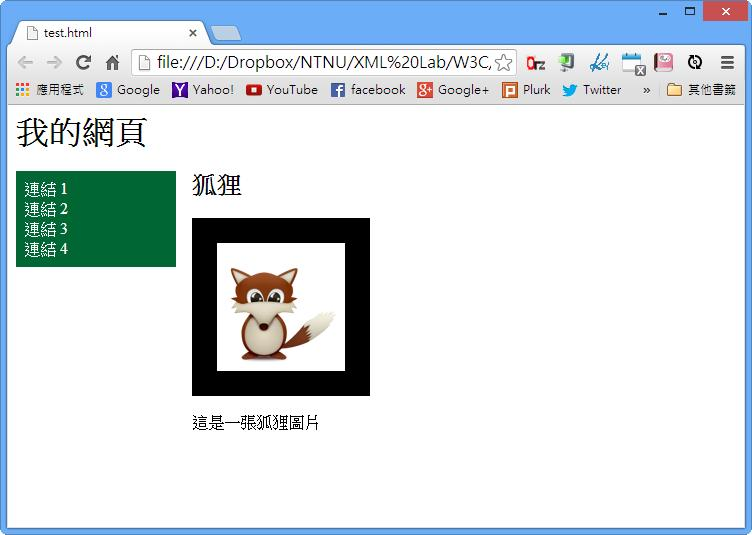
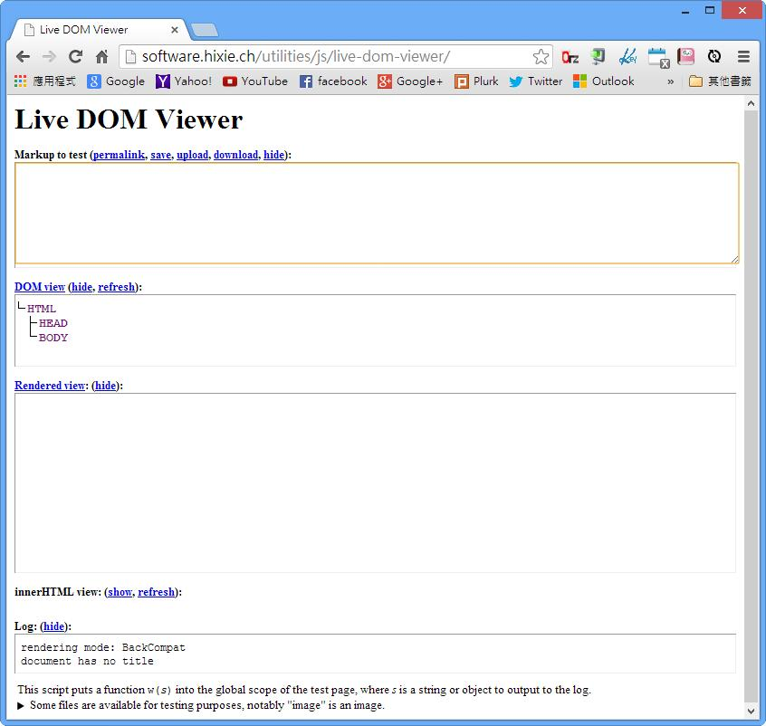

# CS1130203E DOM物件順序需與視覺順序一致

- **稽核評量碼**：CS1130203E
- **對應成功準則**：1.3.2
- **對應認證等級**：A
- **對應國際技術碼**：C27、SCR21
- **類別**：CSS
- **訊息**：DOM物件順序需與視覺順序一致
- **英文訊息**：C27: Making the DOM order match the visual order / SCR21: Using functions of the Document Object Model (DOM) to add content to a page

## 規則說明

任何在HTML或是XHTML使用CSS的網頁，都要遵守此指引。

## 檢測說明

利用眼睛觀察網頁在一般使用者眼前時，每個物件所呈現的順序。

利用DOM工具得到網頁的DOM標籤（這是一個線上DOM工具，將網頁原始碼輸入，可以得到該網站的DOM結構 https://software.hixie.ch/utilities/js/live-dom-viewer/）

檢查DOM工具所呈現的物件，其順序是否與視覺上的順序相同。(對於一常見的英文或中文網站，視覺順序是由上到下、由左到右)

## 說明

無

## 範例

**圖片說明：** 展示HTML代碼的DOM樹結構視圖。結構顯示<html>、<head>、<body>等標籤，其中<head>包含<style>定義CSS樣式（包含letter-spacing、float、display等屬性），<body>包含<h1>「我的網頁」、<ul>列表（包含四個<li><a>連結「連結1」、「連結2」、「連結3」、「連結4」），以及
包含<h2>「狐狸」、
和標籤等。此圖展示HTML代碼的邏輯結構。

**圖片說明：** 展示頁面的視覺呈現。頁面顯示「我的網頁」標題，左側有綠色背景的菜單欄顯示四個連結（「連結1」、「連結2」、「連結3」、「連結4」），右側為主要內容區域，顯示「狐狸」標題、狐狸圖像及描述文字「這是一隻狐狸圖片」。此圖展示通過CSS佈局實現的視覺組織。

**圖片說明：** 展示Live DOM Viewer工具的界面。該工具用於檢查網頁的DOM結構。頁面包含「Markup to test」文本區（上方），「DOM view」顯示HTML結構（中間，顯示<html>、<head>、<body>等標籤），「Rendered view」顯示頁面視覺呈現（下方），以及「Log」顯示任何JavaScript錯誤或警告。此工具可用於驗證DOM物件的順序是否與視覺順序一致，確保無法依賴CSS進行正常瀏覽的使用者也能獲得合理的內容順序。
