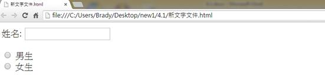
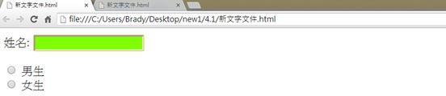
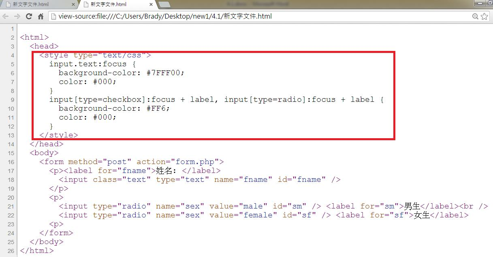

# CS1140101E 當使用者介面元件取得焦點時，使用CSS變更其呈現方式

- **稽核評量碼**：CS1140101E
- **對應成功準則**：1.4.1
- **對應認證等級**：A
- **對應國際技術碼**：C15
- **類別**：CSS
- **訊息**：當使用者介面元件取得焦點時，使用CSS變更其呈現方式
- **英文訊息**：C15: Using CSS to change the presentation of a user interface component when it receives focus

## 規則說明

任何運用CSS來改變呈現方式的HTML或XHTML網頁，都必須要遵守此指引。

## 檢測說明

使用chrome 開啟檔案。

檢查HTML的網頁是否有引用CSS，可改變滑鼠指標所指向的背景顏色。

檢查原始碼 CSS設定背景色的部分。

## 說明

無
## 範例

**圖片說明：** 文字或標籤的簡潔示例截圖。

**圖片說明：** 文字或標籤的簡潔示例截圖。

**圖片說明：** 網頁原始碼的瀏覽器檢視截圖，展示HTML標記和CSS樣式定義。