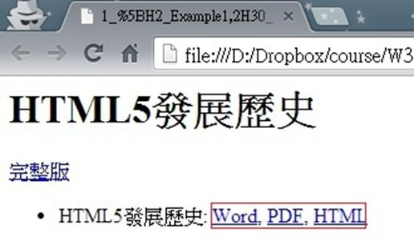
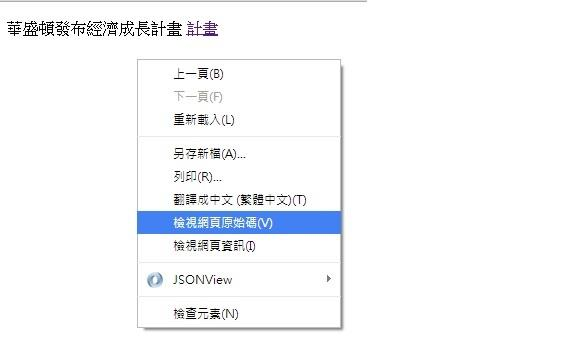

# CS1240405E 在靠近網頁開頭處提供可以變更鏈結文字的控制元件，或使用CSS隱藏部分鏈結文字

- **稽核評量碼**：CS1240405E
- **對應成功準則**：2.4.4
- **對應認證等級**：A
- **對應國際技術碼**：C7
- **類別**：CSS
- **訊息**：在靠近網頁開頭處提供可以變更鏈結文字的控制元件，或使用CSS隱藏部分鏈結文字
- **英文訊息**：G189: Providing a control near the beginning of the Web page that changes the link text / C7: Using CSS to hide a portion of the link text

## 規則說明

任何在HTML或XHTML的網頁內，出現單獨存在的鏈結，此鏈結存在多種類型的話，須提供可以變更鏈結文字的控制元件。

## 檢測說明

1. 檢查各個類型的鏈結內容主題是否相同，並和單獨存在的主鏈結一起檢查。
2. 使用Google Chrome「檢視原始碼」顯示連結(按下右鍵→檢視原始碼)。
3. 檢查是否有使用CSS樣式隱藏部分鏈結文字，如圖隱藏"華盛頓經濟成長計畫"，鏈結文字只顯示"計畫"。

## 說明

無

## 範例

**圖片說明：** 瀏覽器開啟「HTML5發展歷史」範例頁面，頁面顯示主標題「HTML5發展歷史」，下方有「完整版」鏈結，以及條列項目「HTML5發展歷史：Word, PDF, HTML」，其中「Word, PDF, HTML」文字以紅框標示，顯示同一主題提供多種格式的鏈結選項。示範當單一主題存在多種格式鏈結時，應在鏈結文字中清楚標示各格式，讓使用者能區分不同鏈結的目的。

**圖片說明：** 瀏覽器開啟範例頁面，顯示「華盛頓發布經濟成長計畫 計畫」文字，其中「計畫」以超連結形式呈現（使用 CSS 隱藏前段文字「華盛頓經濟成長計畫」，只顯示「計畫」）。頁面彈出右鍵選單，「檢視網頁原始碼」選項以藍色反白標示，示範可透過原始碼確認 CSS 隱藏鏈結文字的實作方式，讓螢幕報讀器能讀取完整的鏈結文字「華盛頓經濟成長計畫計畫」以了解鏈結目的。
