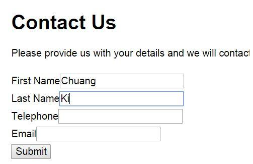

# CS2140402E 縮放含有文字的表單組件

- **稽核評量碼**：CS2140402E
- **對應成功準則**：1.4.4
- **對應認證等級**：AA
- **對應國際技術碼**：C17
- **類別**：CSS
- **訊息**：縮放含有文字的表單組件
- **英文訊息**：C17: Scaling form elements which contain text

## 規則說明

所有網頁中提供需要額外輸入的欄位都必須遵守此指引。

## 檢測說明

對表單中的欄位輸入文字。

將整體內容透過瀏覽器或是網頁提供的功能放大200%。

檢查表單中輸入的文字是否也等比例被放大。

## 說明

無
## 範例

**圖片說明：** 介面元素或設計示例的中等規模截圖。