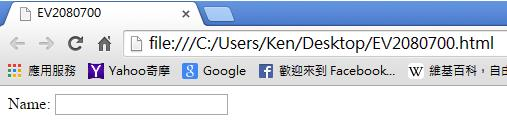
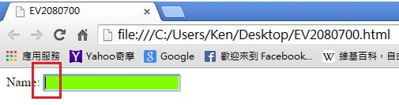
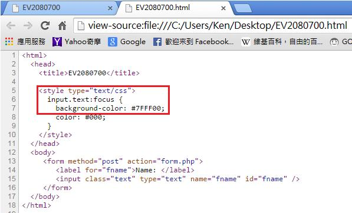

# CS2240700E 使用者介面取得焦點時，使其鍵盤焦點指示具高可見度

- **稽核評量碼**：CS2240700E
- **對應成功準則**：2.4.7
- **對應認證等級**：AA
- **對應國際技術碼**：C15
- **類別**：CSS
- **訊息**：使用者介面取得焦點時，使其鍵盤焦點指示具高可見度
- **英文訊息**：G149: Using user interface components that are highlighted by the user agent when they receive focus G165: Using the default focus indicator for the platform so that high visibility default focus indicators will carry over G195: Using an author-supplied, highly visible focus indicator C15: Using CSS to change the presentation of a user interface component when it receives focus SCR31: Using script to change the background color or border of the element with focus

## 規則說明
當使用者在介面選定焦點來做點選或是鍵盤輸入時，其焦點指示具高可見度。

## 檢測說明
使用Google Chrome瀏覽器開啟檔案。 當使用者把焦點放在輸入行時，其焦點指示具高可見度(輸入行變為綠色)。 可點選右鍵檢視網頁原始碼。此範例使用CSS的:FOCUS動態準類別。

## 說明
無

## 範例

**圖片說明：** 瀏覽器開啟「EV2080700.html」範例頁面，顯示「Name:」標籤與右側空白輸入框，輸入框呈現預設白色背景的未獲焦點狀態，示範焦點取得前的輸入欄位外觀。

**圖片說明：** 同一範例頁面截圖，「Name:」輸入框獲得鍵盤焦點後，輸入框背景變為鮮明的綠色（以紅框標示），游標顯示於框內。示範使用高可見度的焦點指示：當使用者介面元件獲得焦點時，背景色明顯改變，讓使用者（尤其是鍵盤操作者）能清楚辨識目前焦點所在位置。

**圖片說明：** 「EV2080700.html」的 HTML 原始碼，第5至9行以紅框標示 CSS 樣式定義：`input.text:focus { background-color: #7FFF00; color: #000; }`。第13至16行為表單程式碼，包含 `<label for="fname">Name:</label>` 與 `<input class="text" type="text" name="fname" id="fname" />`。示範使用 CSS 的 `:focus` 偽類別，在輸入元件獲得焦點時將背景色改為亮綠色（#7FFF00），提供高可見度的焦點指示。
