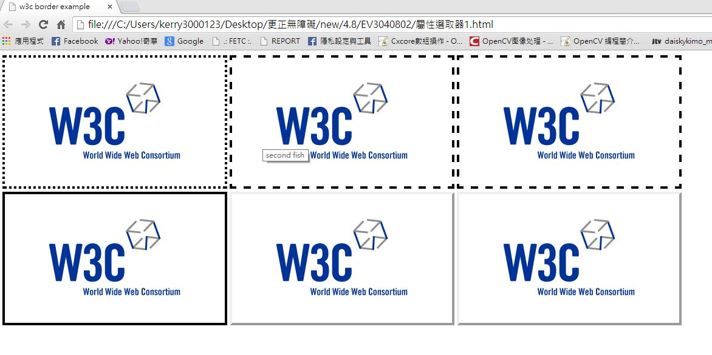
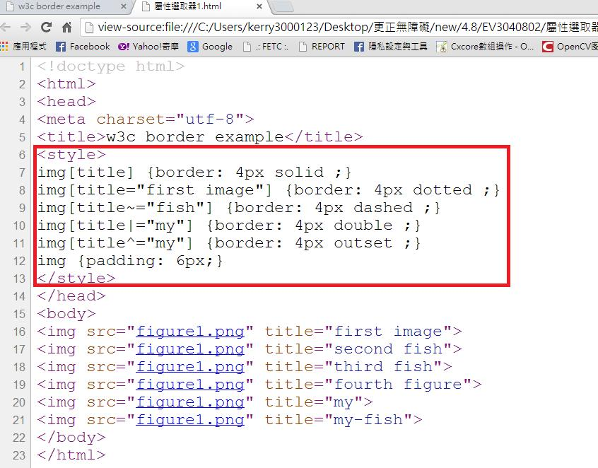

# CS3140802E 在CSS當中劃分區域時僅指定邊框與版面，不要指定文字色彩及文字背景色彩

- **稽核評量碼**：CS3140802E
- **對應成功準則**：1.4.8
- **對應認證等級**：AAA
- **對應國際技術碼**：C25
- **類別**：CSS
- **訊息**：在CSS當中劃分區域時僅指定邊框與版面，不要指定文字色彩及文字背景色彩
- **英文訊息**：C25: Specifying borders and layout in CSS to delineate areas of a Web page while not specifying text and text-background colors

## 規則說明

任何在CSS當中劃分區域時僅指定邊框與版面的網頁，都必須要遵守此指引。

## 檢測說明

使用chrome打開檔案，指定各種邊框的設定，例如此頁面有虛線以及實線的邊框。

檢視原始碼，對各個圖片給予不同的邊框設定。

## 說明

無
## 範例

**圖片說明：** 設計示例，說明如何透過色彩加上文字或其他視覺線索來傳達訊息，確保色覺辨識障礙者也能理解。

**圖片說明：** HTML原始碼截圖，展示使用CSS樣式透過顏色（如紅色和綠色）和文字內容（『這是第一行』、『這是第二行』）同時傳達訊息，確保色覺障礙使用者亦能理解。