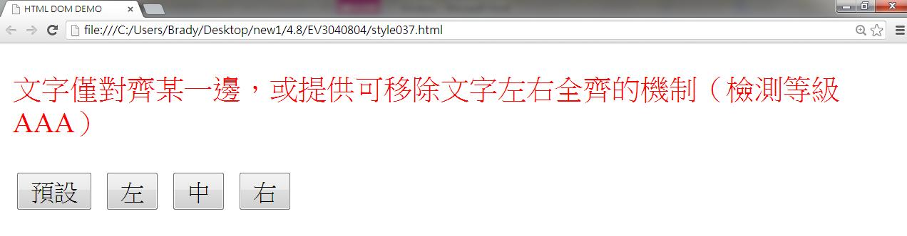
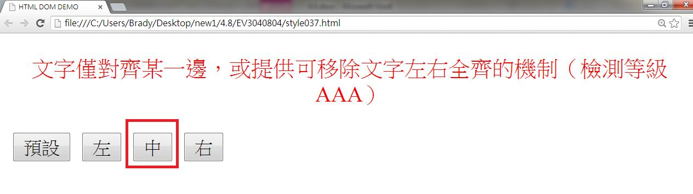
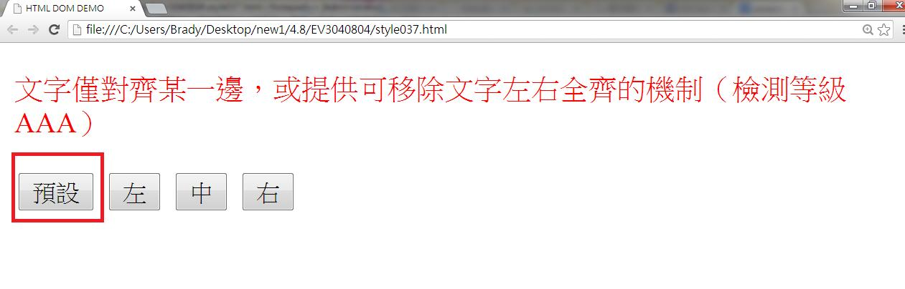
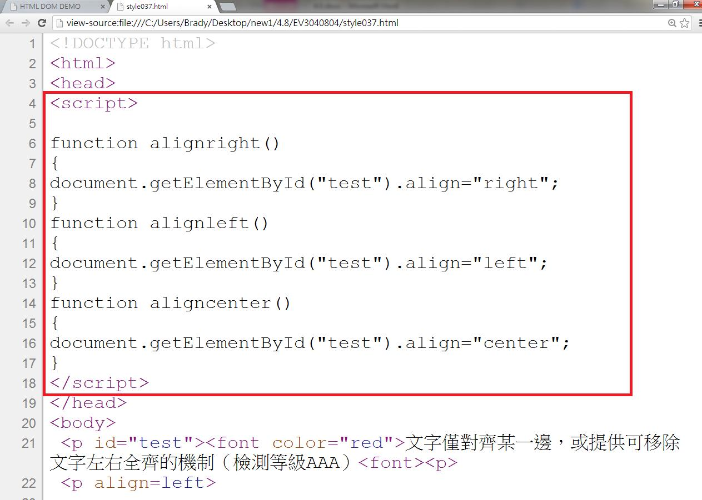

# CS3140803E 文字僅對齊某一邊，或提供可移除文字左右全齊的機制

- **稽核評量碼**：CS3140803E
- **對應成功準則**：1.4.8
- **對應認證等級**：AAA
- **對應國際技術碼**：C19
- **類別**：CSS
- **訊息**：文字僅對齊某一邊，或提供可移除文字左右全齊的機制
- **英文訊息**：G169: Aligning text on only one side / G172: Providing a mechanism to remove full justification of text / C19: Specifying alignment either to the left OR right in CSS

## 規則說明

任何技術關於控制文字對齊功能的網頁，都必須要遵守此指引。

## 檢測說明

用chrome打開檔案，可依按鈕指示變更文字對齊的位置，分別為左、中、右，預設為左邊對齊。

按"中"的按鈕，可使文字以置中方式對齊。

按"右"的按鈕，可使文字靠右邊對齊。

點選"預設"的按鈕，可跳回初始狀態。

檢視原始碼，使用javascript去控制按鈕的對齊方向。

## 說明

無
## 範例

**圖片說明：** 介面元素或設計示例的中等規模截圖。

**圖片說明：** 介面元素或設計示例的中等規模截圖。

**圖片說明：** 介面元素或設計示例的中等規模截圖。

**圖片說明：** 完整的網頁應用介面截圖，展示無障礙實踐的實現效果。

**圖片說明：** 文字或標籤的簡潔示例截圖。