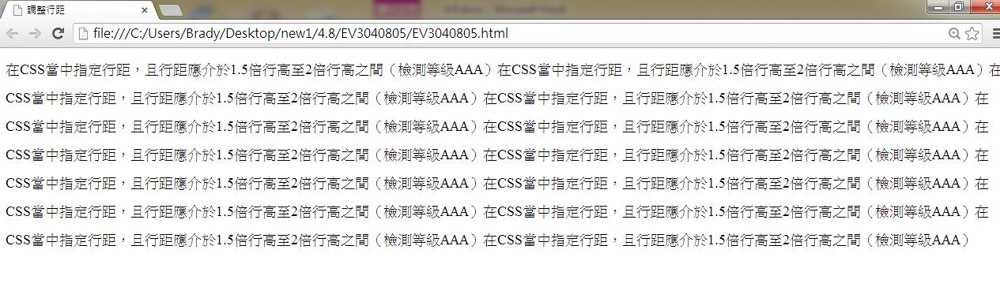
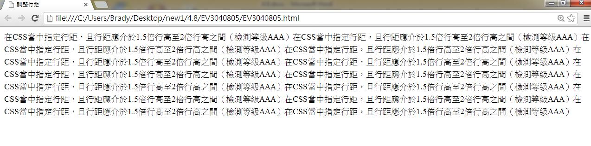
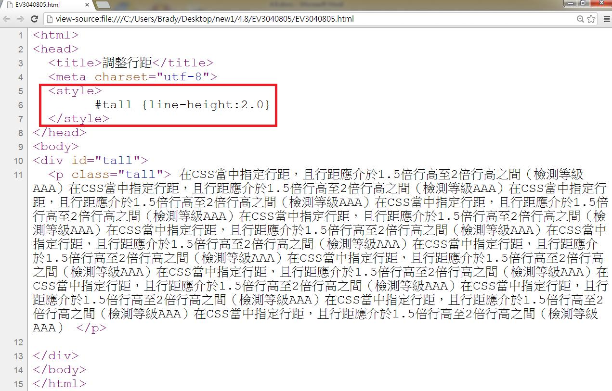

# CS3140804E 在CSS當中指定行距，且行距應介於1.5倍行高至2倍行高之間

- **稽核評量碼**：CS3140804E
- **對應成功準則**：1.4.8
- **對應認證等級**：AAA
- **對應國際技術碼**：C21
- **類別**：CSS
- **訊息**：在CSS當中指定行距，且行距應介於1.5倍行高至2倍行高之間
- **英文訊息**：C21: Specifying line spacing in CSS

## 規則說明

任何技術關於在CSS當中指定行距(介於1.5倍行高至2倍行高之間)的網頁，皆須遵從此指引。

## 檢測說明

用chrome打開檔案，行距設為line-height:2.0。

更改原始碼，設成line-height:1.5。

檢視原始碼。

## 說明

無
## 範例

**圖片說明：** 介面元素或設計示例的中等規模截圖。

**圖片說明：** 介面元素或設計示例的中等規模截圖。

**圖片說明：** 文字或標籤的簡潔示例截圖。