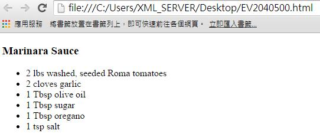
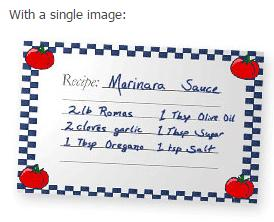

# CS3140900E 只有在純裝飾或者是對於傳達資訊來說以此特定方式呈現文字是必要的情況下，使用CSS來將文字取代成影像文字，並提供使用者介面控制元件來加以切換

- **稽核評量碼**：CS3140900E
- **對應成功準則**：1.4.9
- **對應認證等級**：AAA
- **對應國際技術碼**：C30
- **類別**：CSS
- **訊息**：只有在純裝飾或者是對於傳達資訊來說以此特定方式呈現文字是必要的情況下，使用CSS來將文字取代成影像文字，並提供使用者介面控制元件來加以切換。
- **英文訊息**：C30: Using CSS to replace text with images of text and providing user interface controls to switch

## 規則說明

所有網頁中若包含文字，所有文字必須遵守此指引。

## 檢測說明

原網頁文字【HTML】：
```html
<div id="recipe">
  <h3>Marinara Sauce</h3>
  <ul>
    <li>2 lbs washed, seeded Roma tomatoes</li>
    <li>2 cloves garlic</li>
    <li>1 Tbsp olive oil</li>
    <li>1 Tbsp sugar</li>
    <li>1 Tbsp oregano</li>
    <li>1 tsp salt</li>
  </ul>
</div>
```

使用CSS呈現影像文字【CSS】：
```css
#firHeader {
  width: 300px;
  height: 50px;
  background: #fff url(firHeader.gif) top left no-repeat;
}
#firHeader span {
  display: none;
}
```

## 說明

無
## 範例



**圖片說明：** 介面元素或設計示例的中等規模截圖。



**圖片說明：** 介面元素或設計示例的中等規模截圖。