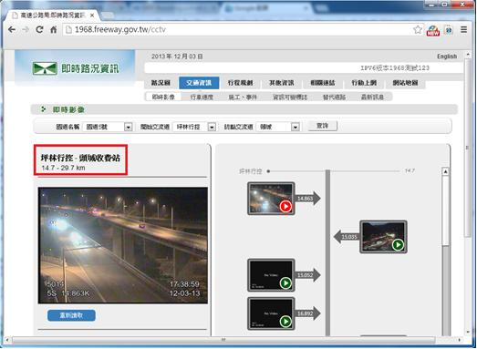
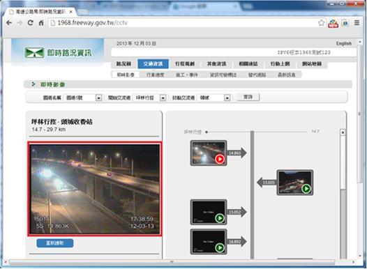

# GN1110107E 提供可描述現場純音訊內容目的及現場純視訊內容目的的描述性標籤

- **稽核評量碼**：GN1110107E
- **對應成功準則**：1.1.1
- **對應認證等級**：A
- **對應國際技術碼**：G68
- **類別**：General
- **訊息**：提供可描述現場純音訊內容目的及現場純視訊內容目的的描述性標籤
- **英文訊息**：G68: Providing a short text alternative that describes the purpose of live audio-only and live video-only content

## 規則說明

網頁上需有提供現場即時影像或音訊，都必須要遵守此指引。

## 檢測說明

1. 網頁上刪除或隱藏冗長的文字敘述，只需要用簡短的文字來描述。
2. 以高速公路實況資訊為例，只以簡短的文字內容來描述此影片。
3. 檢查影像與描述文字是否正確。

## 範例

**圖片說明：** 台灣高速公路即時路況資訊網頁，標題「即時路況資訊」。頁面顯示「跨竹竿-國道欣柱」路段資訊，左側有紅色方框突出標籤「跨竹竿-國道欣柱 14.7～29.7km」，下方顯示該路段的即時視訊畫面，可見夜間高速公路的車流情況。右側顯示多個攝影機位置和編號。此為展示現場純視訊內容需要簡短描述性標籤的範例。

**圖片說明：** 與第一張圖相似的網頁畫面，但左側視訊播放區域已被紅色方框突出強調。該視訊框框內顯示路況監視影像（時間戳記 12:38:59～12:03:15），視訊左上角有播放控制按鈕。此圖強調在現場即時視訊內容周圍必須提供清晰的描述性標籤，以便用戶快速理解影像內容的用途與位置。