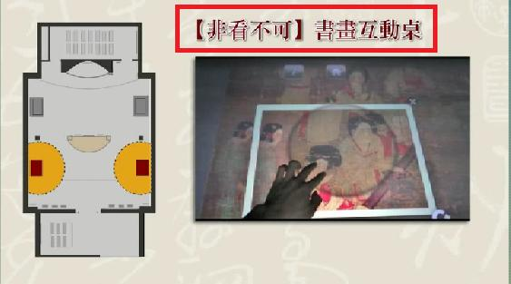
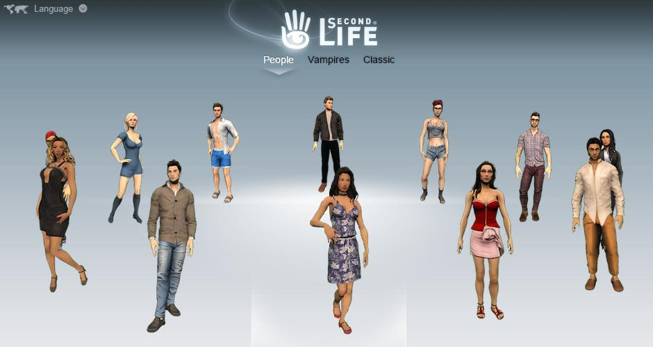

# GN1110109E 針對虛擬實境、立體成像、或環場空間等知覺體驗的非文字內容需要有替代文字或長描述

- **稽核評量碼**：GN1110109E
- **對應成功準則**：1.1.1
- **對應認證等級**：A
- **對應國際技術碼**：G82、G92、G94、G95、G96、G100
- **類別**：General
- **訊息**：針對虛擬實境、立體成像、或環場空間等知覺體驗的非文字內容需要有替代文字或長描述，並至少要為這些非文字內容提供描述性的識別資訊
- **英文訊息**：G82、G92、G94、G95、G96、G100

## 規則說明

任何使用虛擬實境、立體成像、或環場空間的網頁都必須要符合此指引。

## 檢測說明

- 範例：故宮博物館的「非看不可互動桌」就是立體影像。
- Second Life 網頁中的虛擬實境。

針對此類非文字內容，需提供替代文字或長描述，至少要為這些非文字內容提供描述性的識別資訊。

## 範例

**圖片說明：** 故宮博物館「非看不可」互動桌的示意圖（左側）顯示桌面平面圖，包含黃色座位區和互動感應區。右側為實際立體成像影像，展示人手在螢幕上與立體人物影像互動的場景。上方紅色方框突出標籤「【非看不可】書畫互動桌」，說明這是立體影像展示內容。此範例展示虛擬實境與立體成像內容需要提供替代文字說明。

**圖片說明：** Second Life 虛擬現實平台首頁，標題「SECOND LIFE」，頁面導覽菜單包括「People」、「Vampires」、「Classic」等選項。畫面顯示多個虛擬人物角色，著裝各異，以 3D 形象呈現立於虛擬空間中。此為虛擬實境環境的典型例子，需要提供描述性識別資訊，說明該虛擬世界的目的、可用功能和使用者角色等訊息，以便視覺障礙或知覺體驗不同的用戶理解內容。