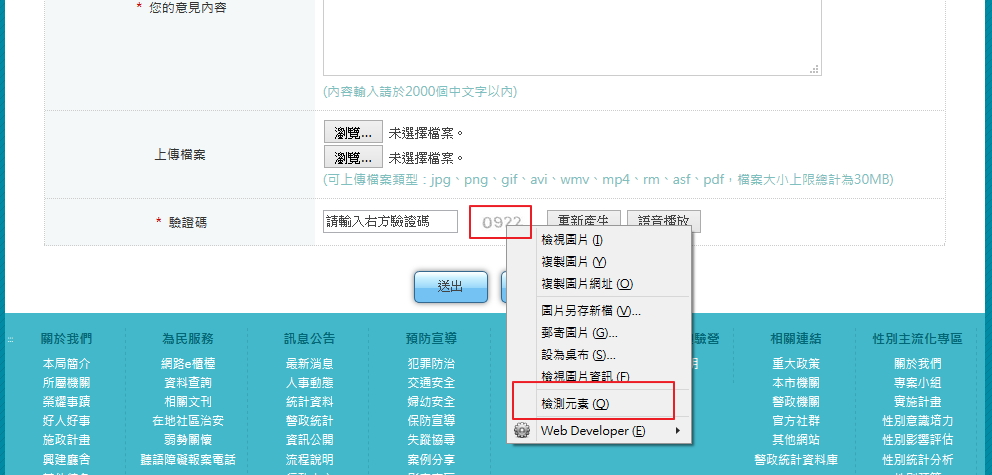
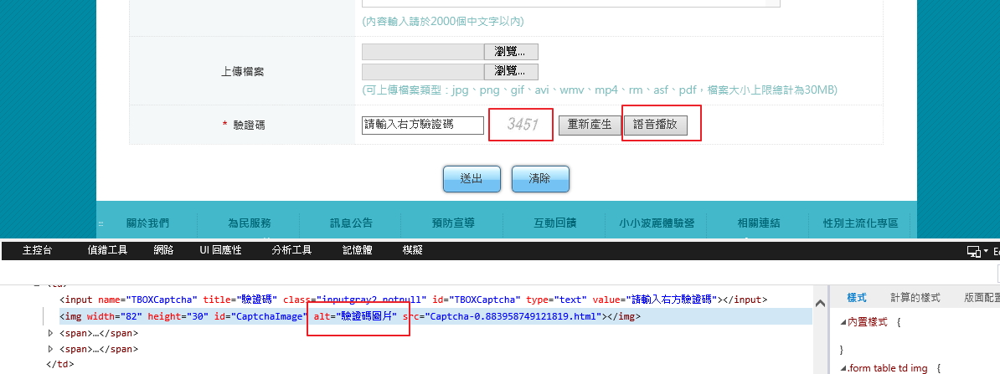

# GN1110110E 任何CAPTCHA驗證均需提供描述CAPTCHA驗證目的的替代文字

- **稽核評量碼**：GN1110110E
- **對應成功準則**：1.1.1
- **對應認證等級**：A
- **對應國際技術碼**：G143
- **類別**：General
- **訊息**：任何CAPTCHA驗證均需提供描述CAPTCHA驗證目的的替代文字
- **英文訊息**：G143: Providing a text alternative that describes the purpose of the CAPTCHA

## 規則說明

任何使用 CAPTCHA 驗證的網頁都必須要符合此指引。

## 檢測說明

1. 在需要輸入驗證碼的網頁，於「驗證碼」的欄位以滑鼠右鍵開啟「檢查元素」。
2. 在「檢測元素」中確認驗證碼的圖形文字為「驗證碼」，並有提供語音播放的替代方式。

## 範例

**圖片說明：** 網頁表單顯示驗證碼區域。左側欄位標籤「驗證碼」後，中央顯示驗證碼圖片（「0922」），右側出現右鍵快捷選單，選項包含「替換圖片」、「複製圖片 ID」、「複製圖片路徑」等。驗證碼圖片右側有「更新產生」、「語音播放」、「複製圖片 ID」等按鈕。此示例展示 CAPTCHA 驗證表單和相關的語音播放替代選項。

**圖片說明：** 網頁表單清晰視圖，驗證碼欄位顯示「3451」的圖片驗證碼（紅色方框標示），右側提供「更新產生」和「語音播放」兩個按鈕（紅色方框突出語音播放選項）。下方顯示 HTML 程式碼，其中 `` 標籤的 `alt="驗證碼圖片"` 屬性（紅框突出）明確說明驗證碼的目的。此範例展示正確的 CAPTCHA 無障礙實作，提供描述驗證目的的替代文字和語音播放功能。