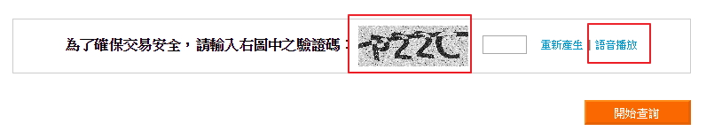
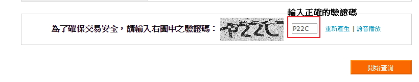

# GN1110111E 網頁上任何一個CAPTCHA驗證均至少有另一個運用不同形式的CAPTCHA驗證，且具有相同的目的與功能

- **稽核評量碼**：GN1110111E
- **對應成功準則**：1.1.1
- **對應認證等級**：A
- **對應國際技術碼**：G144
- **類別**：General
- **訊息**：網頁上任何一個CAPTCHA驗證均至少有另一個運用不同形式的CAPTCHA驗證，且具有相同的目的與功能
- **英文訊息**：G144: Ensuring that the Web Page contains another CAPTCHA serving the same purpose using a different modality

## 規則說明

任何關於在一個CAPTCHA驗證均至少有另一個運用不同形式的CAPTCHA驗證的網頁，皆須遵守此指引。

## 檢測說明

開啟檔案，以高鐵訂票系統為例，有圖形式CAPTCHA和音頻式CAPTCHA。

可以透過「圖形」或「聲音」方式得知並正確輸入驗證碼，即可通過驗證。

## 說明

無

## 範例

**圖片說明：** 高鐵訂票系統驗證碼區域，左側文字說明「為了確保交易安全，請輸入右圖中文字驗證碼」。中央顯示圖形式 CAPTCHA 驗證碼圖片（「ㄢZZC」，用紅色方框標示），右側輸入欄位後有「重新產生」和「語音播放」連結（紅色方框突出語音播放選項）。下方顯示橙色「確認查詢」按鈕。此示例展示圖形式 CAPTCHA 的實作，同時提供語音播放替代選項。

**圖片說明：** 驗證碼輸入畫面，上方顯示「輸入正確的驗證碼」提示。左側文字同樣為「為了確保交易安全，請輸入右圖中文字驗證碼」，中央的圖形驗證碼（「ㄢZZC」）已被正確辨識，右側輸入欄顯示「P22C」作為對應的音聲驗證碼結果（用紅色方框標示）。此頁面展示用戶可以選擇圖形或聲音方式輸入驗證碼，兩者具有相同目的與功能，提供多種形式的 CAPTCHA 驗證選項。