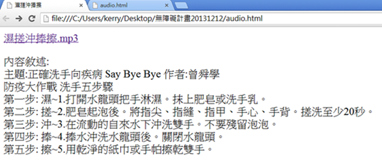
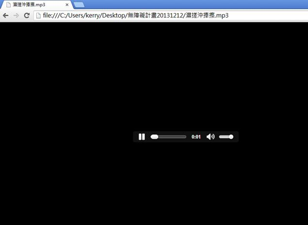
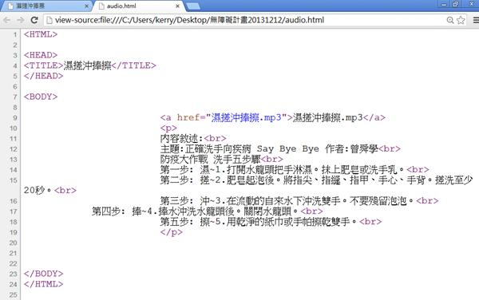

# GN1120100E 提供預先錄製之純音訊內容的等義資訊替代內容

- **稽核評量碼**：GN1120100E
- **對應成功準則**：1.2.1
- **對應認證等級**：A
- **對應國際技術碼**：G158
- **類別**：General
- **訊息**：提供預先錄製之純音訊內容的等義資訊替代內容
- **英文訊息**：G158: Providing an alternative for time-based media for audio-only content

## 規則說明

所有關於時序媒體替代內容(此針對純音訊)的網頁，皆須遵守此指引。

## 檢測說明

打開檔案，此處設為純音訊內容(此以"洗手教學為範例")，下方有音訊的內容敘述。

點選紫色文字部分，即可播放音訊檔(內容為洗手步驟)，此處設為純音訊內容。

檢視原始碼。

## 說明

無

## 範例

**圖片說明：** 瀏覽器顯示洗手教學頁面，標題「洗淨沖掉擦」。頁面包含紫色超連結「洗淨沖掉擦.mp3」，下方顯示詳細文字內容說明「內容敘述：主題：正確洗手的五步驟 Say Bye Bye 作者：曾琇學」，以及五個步驟的詳細描述，包括「第一步：濕-1.打開水龍頭把手洗溼」等步驟。此頁面展示純音訊內容與對應的文字替代內容。

**圖片說明：** 音訊播放器視窗，標題顯示「洗淨沖掉擦.mp3」，播放器中央顯示標準播放控制，包括暫停鍵、進度條（時間 0:01）、音量控制和靜音按鈕。此為純音訊內容的播放介面，用戶可透過此播放器聆聽洗手教學音訊內容。

**圖片說明：** Firefox 原始碼檢視視窗，顯示 HTML 程式碼。第 9 行可見 `<a href="洗淨沖掉擦.mp3">洗淨沖掉擦.mp3</a>` 超連結標籤。第 10-19 行的 `
` 標籤內包含純文字的詳細說明內容，描述洗手教學的五個步驟，包括「主題：正確洗手的五步驟 Say Bye Bye」及「防疫大作戰，洗手五步驟」等資訊。此範例展示提供與音訊內容等義的文字替代內容的正確實作方式。