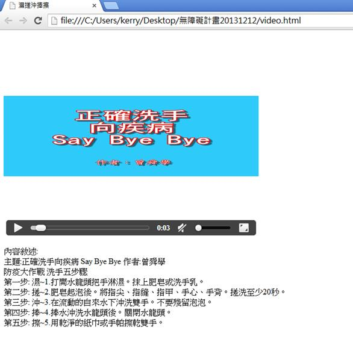
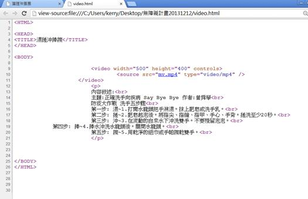

# GN1120101E 提供預先錄製之純視訊內容的等義資訊替代內容

- **稽核評量碼**：GN1120101E
- **對應成功準則**：1.2.1
- **對應認證等級**：A
- **對應國際技術碼**：G159
- **類別**：General
- **訊息**：提供預先錄製之純視訊內容的等義資訊替代
- **英文訊息**：G159: Providing an alternative for time-based media for video-only content

## 規則說明

所有關於時序媒體替代內容(此針對純視訊內容)的網頁，皆須遵守此指引。

## 檢測說明

打開檔案，此處設為純視訊內容的影片(此以"洗手教學為範例")，下方有影片內容敘述。

檢視原始碼。

## 說明

無

## 範例

**圖片說明：** 展示一個純視訊內容的範例，其中包含一個洗手教學影片。畫面上方顯示標題「正確洗手」和「Say Bye Bye」，下方是影片播放器（含播放按鈕、進度條和音量控制等控制項），播放器下方有詳細的文字說明，列舉了五個洗手步驟：第一步、第二步、第三步、第四步、第五步，每步均有具體的洗手操作描述（例如冼手心、洗手背、洗手指縫等）。此圖說明應提供視訊內容的等義文字替代內容。

**圖片說明：** 展示檢查純視訊內容無障礙實現的原始碼檢視。左側顯示HTML結構，包含<video>標籤和<source>元素，右側則顯示源代碼檢視的詳細內容。標示重點：在<video>標籤中應包含width、height和controls屬性，<source>元素應指定視訊檔案位置和類型。同時，以
標籤提供該視訊內容的完整文字敘述，包含標題和五步驟說明。此圖展示正確的純視訊無障礙實現方式，通過HTML代碼結構確保所有使用者都能存取視訊內容。
