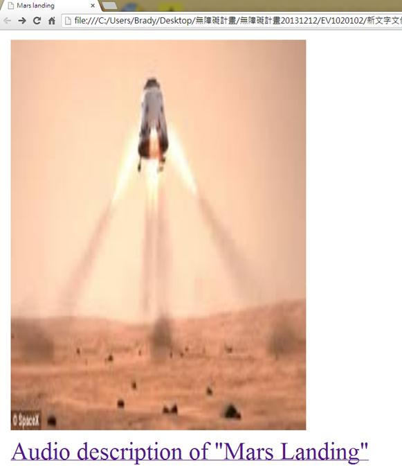
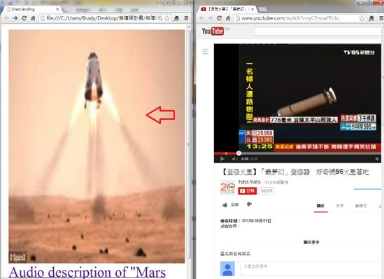
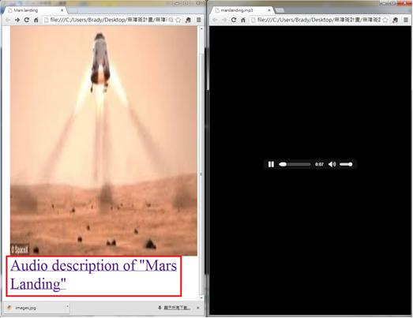
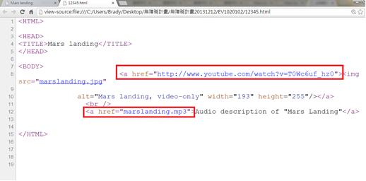

# GN1120102E 提供描述預先錄製之重要視訊內容的音訊，並描述其本身係用於描述重要視訊內容

- **稽核評量碼**：GN1120102E
- **對應成功準則**：1.2.1
- **對應認證等級**：A
- **對應國際技術碼**：G166
- **類別**：General
- **訊息**：提供描述預先錄製之重要視訊內容的音訊，並描述其本身係用於描述重要視訊內容
- **英文訊息**：G166: Providing audio that describes the important video content and describing it as such

## 規則說明

所有包括有提供描述預先錄製之重要視訊內容的音訊，並且有描述其本身係用於描述重要視訊內容等相關網頁，皆須遵守此指引。

## 檢測說明

開啟網頁，此以連結到飛船降落火星的新聞視頻為例，連接到視頻的初始畫面是一個飛船的圖片，而視頻下方有一個關於影片內容的音訊檔案。

當點選左圖紅色箭頭的飛船圖片可連接到右圖的飛船降落火星的新聞視頻。

而點選紫色字幕的音訊連結可執行一個關於影片內容的音訊檔案。

檢視原始碼，紅色框分別為視訊檔案和音訊檔案。

## 說明

無

## 範例

**圖片說明：** 展示火星登陸視訊的初始畫面，文字標題標記為「Audio description of 'Mars Landing'」。圖片內容顯示一艘太空飛船垂直降落於火星表面，背景為沙漠地形，左下角有版權標示。此圖為提供音訊描述的視訊來源示例。

**圖片說明：** 分割畫面展示，左側為火星登陸視訊圖片，右側為YouTube視訊播放頁面。右側顯示視訊標題、中文字幕、視訊統計信息（如觀看次數、發佈日期等），以及視訊說明和留言區域。左側圖片下方標註「Audio description of 'Mars Landing'」，並用紅色箭頭指向，說明此為視訊的替代音訊版本。此圖展示視訊與其音訊描述替代內容之間的關聯。

**圖片說明：** 分割畫面展示代碼檢視和播放器對比。左側顯示火星登陸視訊圖片，下方用紅色方框標註「Audio description of 'Mars Landing'」的文字連結；右側顯示黑色背景的音訊播放器，包含暫停/播放按鈕、進度條和時間顯示（如0:47/4:05）。此圖說明視訊應提供對應的音訊描述資源，並可通過播放器訪問。

**圖片說明：** 展示HTML原始碼，重點標示在紅色方框內。代碼顯示：(1)<a>標籤連結指向YouTube視訊「http://www.youtube.com/watch?v=TOW06uf_b20」；(2)視訊描述標籤
內容為「Mars landing, video-only」，表明該資源為純視訊；(3)<a>標籤連結指向「marslanding.mp3」音訊檔案，並標記為「Audio description of 'Mars Landing'」。此圖展示在HTML代碼中正確提供視訊和其音訊描述替代內容的實現方法。
