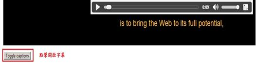
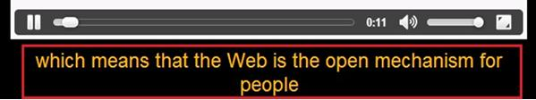

# GN1120200E 提供預先錄製之音訊內容的隱藏式或非隱藏式(永遠看得到的)字幕

- **稽核評量碼**：GN1120200E
- **對應成功準則**：1.2.2
- **對應認證等級**：A
- **對應國際技術碼**：G87、G93、H95
- **類別**：General
- **訊息**：提供預先錄製之音訊內容的隱藏式或非隱藏式(永遠看得到的)字幕
- **英文訊息**：G87: Providing closed captions / G93: Providing open (always visible) captions / H95: Using the track element to provide captions

## 規則說明

任何在HTML或XHTML的網頁內，如果有提供預錄製的音訊內容，都需要遵守此指引。

檢測是否有非隱藏字幕。

## 檢測說明

檢查播放音訊時是否有隱藏式字幕，並且與內容相符合。

或是播放音訊時有非隱藏字幕，並且與內容相符合。

## 說明

無

## 範例

**圖片說明：** 展示音訊播放器搭配隱藏式字幕的實現方式。黑色背景上方是音訊播放器控制欄（含播放按鈕、進度條、音量控制等），下方顯示黃色文字「is to bring the Web to its full potential,」，左下角標有紅色方框「Toggle captions」按鈕和中文文字「開啟隱藏字幕」。此圖說明應提供可切換開啟的隱藏式字幕功能。

**圖片說明：** 展示非隱藏式字幕（開放式字幕）的實現方式。音訊播放器的時間顯示為0:11，下方顯示黃色文字「which means that the Web is the open mechanism for people」，用紅色方框標示。此圖展示使用者無需按按鈕，字幕始終顯示在頁面上，確保所有使用者都能同時看到音訊內容的對應字幕。
