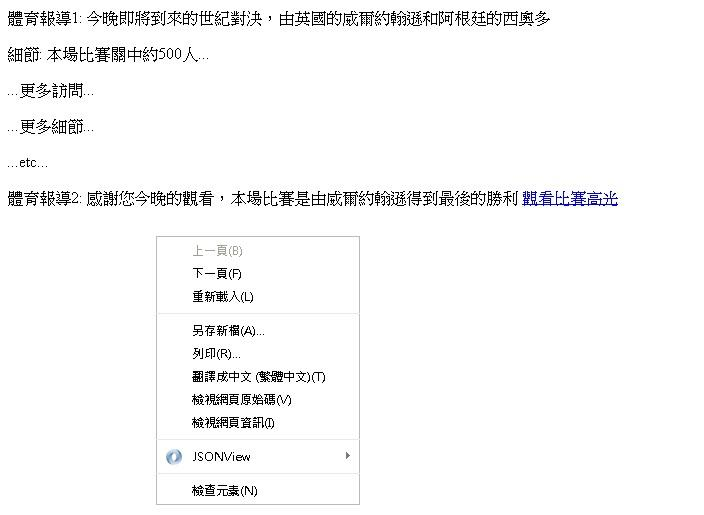
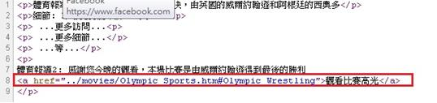

# GN1120300E 提供預先錄製之時序媒體的替代內容，並在時序媒體的非文字內容後馬上放置連往替代內容的鏈結

- **稽核評量碼**：GN1120300E
- **對應成功準則**：1.2.3
- **對應認證等級**：A
- **對應國際技術碼**：G58、G69
- **類別**：General
- **訊息**：提供預先錄製之時序媒體的替代內容，並在時序媒體的非文字內容後馬上放置連往替代內容的鏈結
- **英文訊息**：G58: Placing a link to the alternative for time-based media immediately next to the non-text content / G69: Providing an alternative for time based media

## 規則說明

任何運用HTML或XHTML時序媒體及同步媒體的網頁，都必須要遵守此指引。

## 檢測說明

使用Google Chrome「檢視原始碼」顯示連結 (按下右鍵→檢視原始碼)。

檢查是否有提供在非文字內容後馬上放置連往替代內容的鏈結，並點擊連結來驗證。

## 說明

無

## 範例

**圖片說明：** 展示時序媒體替代內容的頁面示例。上半部分顯示「體育報導1」和「體育報導2」兩個報導，其中第一項敘述為「今晚即將到來的世紀對決，由英國的時開始時與對手達的西與多細節」，包含佔比例信息（500人以上）和「更多節間」、「更多節節」等額外內容指示。下方顯示右鍵菜單（包含上一頁、下一頁、重新載入、儲存新頁等選項），以及選擇字幕語言的選項（繁體中文、被選擇菜單等）。此圖說明應在時序媒體內容旁邊提供替代內容的存取方式。

**圖片說明：** 展示HTML原始碼實現，重點標示在紅色方框內。代碼顯示多個
標籤元素包含報導內容（「體育報導1」「體育報導2」等），以及一個<a>標籤元素連結到「movies/sports.html#olympic_treatling1」，該連結標籤標註為「體育賽事直播1 - 奧運比賽」。此圖展示正確的HTML結構，即在非文字內容之後立即放置指向替代內容的超連結，例如將視訊內容連結到其對應的文字敘述頁面。
