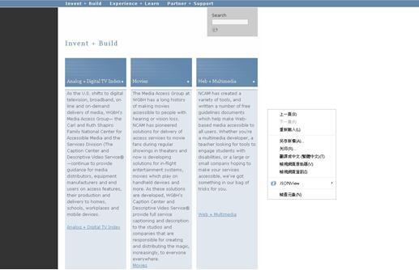
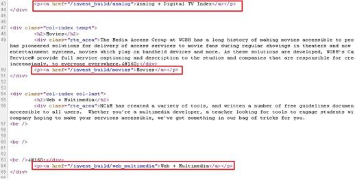

# GN1120301E 除非同步媒體是文字內容的替代媒體，並且有明確地標示出來，否則就為影片提供音訊描述或延伸音訊描述，或提供使用者可選取、且含有音訊描述的第二音軌

- **稽核評量碼**：GN1120301E
- **對應成功準則**：1.2.3
- **對應認證等級**：A
- **對應國際技術碼**：G8、G78、G173、H96
- **類別**：General
- **訊息**：除非同步媒體是文字內容的替代媒體，並且有明確地標示出來，否則就為影片提供音訊描述或延伸音訊描述，或提供使用者可選取、且含有音訊描述的第二音軌
- **英文訊息**：G8: Providing a movie with extended audio descriptions / G78: Providing a second, user-selectable, audio track that includes audio descriptions / G173: Providing a version of a movie with audio descriptions / H96: Using the track element to provide audio descriptions

## 規則說明

任何運用HTML或XHTML時序媒體及同步媒體的網頁，都必須要遵守此指引。

## 檢測說明

**範例1：含有第二音軌的視頻**

使用Google Chrome「檢視原始碼」顯示連結 (按下右鍵→檢視原始碼)。

檢查是否有提供具有音訊描述或額外音訊描述的電影，或提供使用者可選取、且含有音訊描述的第二音軌，並點擊連結來驗證。

**範例2：英語視頻的video標籤，音頻描述提供WebVTT格式**

原始碼 (HTML5)
```html
<video poster="myvideo.png" controls>
  <source src="myvideo.mp4" srclang="en" type="video/mp4">
  <track src="myvideo_en.vtt" kind="descriptions" srclang="en" label="English">
</video>
```

**範例3：視頻video標籤有英語和法語，音頻描述提供英文，並以WebVTT插入VTT文件的格式插入法文說明軌道**

原始碼 (HTML5)
```html
<video poster="myvideo.png" controls>
  <source src="myvideo.mp4" srclang="en" type="video/mp4">
  <source src="myvideo.webm" srclang="fr" type="video/webm">
  <track src="myvideo_en.vtt" kind="descriptions" srclang="en" label="English">
  <track src="myvideo_fr.vtt" kind="descriptions" srclang="fr" label="French">
</video>
```

## 說明

無

## 範例



**圖片說明：** 展示媒體存取組織（Media Access Group）網頁，顯示三個主要內容區塊：「Making a Digital TV Index」、「Media」和「and a Multimedia」。每個區塊包含詳細的文字說明，敘述媒體無障礙服務的提供情況、NCAM的成立背景及其工作。頁面右側附有選單，包含「上面回」、「下面」、「含括內文」等導航選項，以及編號列表（03、05、08等）。此圖展示提供音訊描述或延伸音訊描述的視訊頁面結構。



**圖片說明：** 展示HTML原始碼實現。代碼中標示多個<a>標籤，重點以紅色方框標記，包含：(1)「<a href="/movies/digitalliving/analog + digital tv index</a>」；(2)「<a href="#...MultiMedia">Media + Multimedia</a>」；(3)「<a href="/more...</Moviee</a>」等連結。這些代碼表示為同步媒體提供了用戶可選取且包含音訊描述的替代軌道或連結，實現無障礙訪問。
