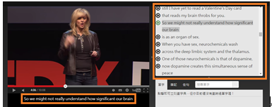
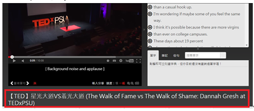

# GN1120302E 影片畫面僅呈現講者頭部視訊時，提供靜態文字替代

- **稽核評量碼**：GN1120302E
- **對應成功準則**：1.2.3
- **對應認證等級**：A
- **對應國際技術碼**：G203
- **類別**：General
- **訊息**：影片畫面僅呈現講者頭部視訊時，提供靜態文字替代
- **英文訊息**：G203: Using a static text alternative to describe a talking head video

## 規則說明

需要提供影片的靜態替代文字(例如演講者資訊、演講內容摘要以及演講標題等等)

## 檢測說明

若有影片外的描述(例如演講者資訊、演講內容以及演講標題等等)，則通過檢測。

- 演講的內容
- 演講的標題

## 說明

無

## 範例

**圖片說明：** 展示TED演講視訊播放畫面，左側顯示發言人站在舞台上演講的視訊（約1秒位置），右側顯示該視訊的音訊描述列表，包含編號項目（如「1.Our friend is from..」、「2.He imagined a world understands..」等）。下方標註「An angel had really understood how empirical facts..」表示音訊描述的內容。此圖說明同步媒體應提供詳細的音訊描述版本，讓無法看到視訊的使用者也能理解內容。

**圖片說明：** 展示另一個TED演講視訊片段，左側為舞台場景（顯示「Background noise and applause」標註），右側為對應的音訊描述列表。列表項目包含（「1.What a natural tooth up..」、「2.This wondering if you had the same..」、「3.There are college cannyears..」、「4.There about 12 years old..」等）。下方顯示視訊標題「【TED】見光人AVS與大鼻子 (The Walk of Fame vs The Walk of Shame: Danah Gresh at TEDxPSU)」，以紅色方框標示。此圖進一步展示音訊描述應包含背景音和各種非視覺信息，確保完整的內容傳達。
