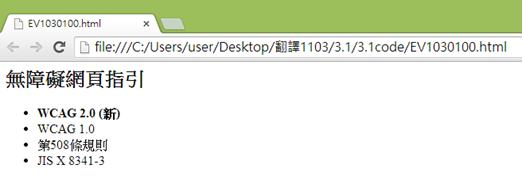
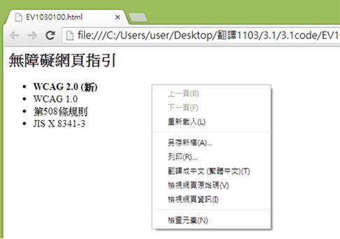
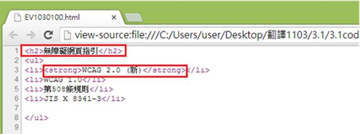

# GN1130100E 使用文字來傳達藉由文字呈現上的變化所傳達的資訊

- **稽核評量碼**：GN1130100E
- **對應成功準則**：1.3.1
- **對應認證等級**：A
- **對應國際技術碼**：G117
- **類別**：General
- **訊息**：使用文字來傳達藉由文字呈現上的變化所傳達的資訊
- **英文訊息**：G117: Using text to convey information that is conveyed by variations in presentation of text

## 規則說明

當文字需要以變化性方式呈現(例如：文字以粗體表示)時，須遵守此指引。

## 範例

使用Google Chrome瀏覽器開啟檔案

點選右鍵檢視網頁原始碼。

從程式碼中可以瞭解到以文字格式標籤來表示的文字效果，如下`<strong>`會將文字改成粗體(即WCAG 2.0 (新)為粗體字)，`<h2>`為設定的標題大小，因此標題無障礙網頁指引也會一般字體大小有所不同。

## 說明

無

## 範例

**圖片說明：** 展示網頁頁面標題「無障礙網頁直指引」，並列舉四個無障礙相關的規範列表項目：「WCAG 2.0 (新)」、「WCAG 1.0」、「第508條規則」和「JIS X 8341-3」。頁面使用綠色背景，標題和列表項以黑色文字呈現，展示網頁的基本結構。此圖說明應使用語意標籤（如<h2>用於標題，<li>用於列表項）來標記不同層級的文字，而不是僅依賴視覺樣式。

**圖片說明：** 展示同一網頁的右鍵內容菜單。菜單顯示標準的瀏覽器選項，包括「上一頁(B)」、「下一頁(F)」、「重新載入(L)」、「另存新頁(A)...」、「另存(R)...」、「書籤←=→ (星標=圖)(T)」、「檢視網頁原始碼(V)」、「檢視網頁資訊(I)」、「檢查元素(N)」等。此圖展示使用者可通過右鍵菜單查看網頁原始碼，以驗證語意標籤的使用。

**圖片說明：** 展示HTML原始碼檢視。重點以紅色方框標示「<h2>無障礙網頁直指引</h2>」，下方顯示<ul>列表，包含四個<li>列表項目，分別標記為「<strong>WCAG 2.0 (新)</strong>」、「WCAG 1.0」、「第508條規則」和「JIS X 8341-3」。此代碼結構展示正確使用語意標籤的實現方式：<h2>用於標題，<ul>和<li>用於列表，<strong>用於強調文字（代替純粹依賴視覺樣式如粗體）。
