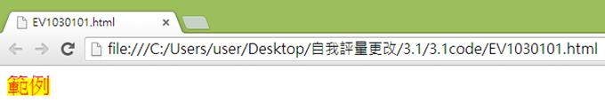
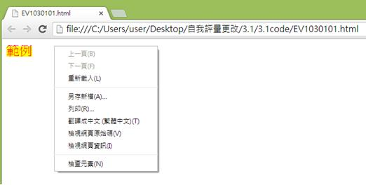
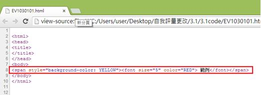

# GN1130101E 使用顏色線索的時候就使用語意標記

- **稽核評量碼**：GN1130101E
- **對應成功準則**：1.3.1
- **對應認證等級**：A
- **對應國際技術碼**：G138
- **類別**：General
- **訊息**：使用色彩線索的時候就使用語意標記
- **英文訊息**：G138: Using semantic markup whenever color cues are used

## 規則說明

使用顏色改變文字時，須遵守此指引。

## 檢測說明

使用Google Chrome瀏覽器開啟檔案(網頁內改變文字顏色：以紅色字體以及字體背景色為黃色為例)

點選右鍵檢視網頁原始碼

使用顏色改變文字時可以用CSS樣式表顏色屬性來表示，例如：background-color為背景顏色，color可調整文字顏色。下列範例中我們得知從`` 可將文字背景色設置成黃色，``可將文字設為紅色。

## 說明

無

## 範例

**圖片說明：** 展示網頁標題「範例」，標題呈現為黃色背景（無遮擋背景色）。頁面使用綠色作為主背景色。標題「範例」以黃色呈現，旨在通過顏色（黃色背景）來吸引使用者注意。此圖說明不應單獨依賴顏色變化來傳達資訊。

**圖片說明：** 展示同一網頁的右鍵內容菜單。菜單選項包括「上一頁(B)」、「下一頁(F)」、「重新載入(L)」、「另存新頁(A)...」、「另存(R)...」、「書籤←=→ (星標=圖)(T)」、「檢視網頁原始碼(V)」、「檢視網頁資訊(I)」、「檢查元素(N)」等。此圖展示使用者檢查HTML原始碼以驗證色彩線索是否配合了語意標籤。

**圖片說明：** 展示HTML原始碼檢視。重點以紅色方框標示「 WP」，上方顯示<html>、<head>、<title>標籤等基本結構。此代碼段落展示正確的實現方式：結合使用語意標籤（如）和CSS樣式屬性（background-color: YELLOW）來設置背景顏色，以及標籤的color屬性（color="RED"）來設置文字顏色。這樣確保色彩變化不僅作為視覺線索，還通過代碼結構提供語意信息，讓所有使用者（包括視覺障礙使用者）都能理解信息的重要性。
