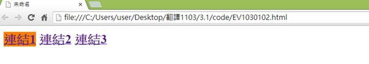
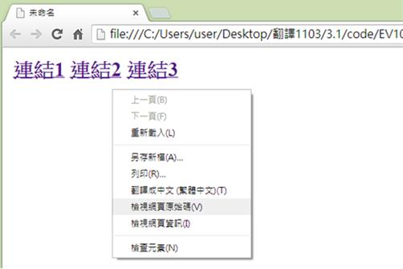
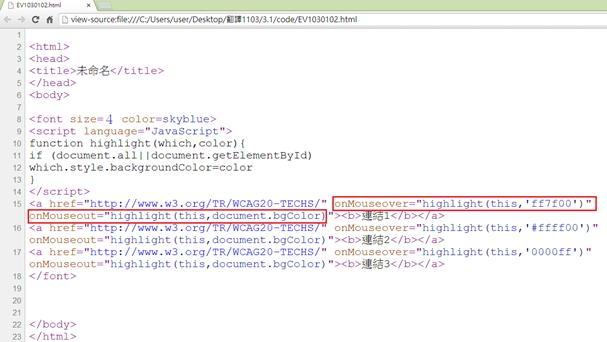

# GN1130102E 從呈現當中抽離資訊與結構，以便啟用不同的呈現

- **稽核評量碼**：GN1130102E
- **對應成功準則**：1.3.1
- **對應認證等級**：A
- **對應國際技術碼**：G140
- **類別**：General
- **訊息**：從呈現當中抽離資訊與結構，以便啟用不同的呈現
- **英文訊息**：G140: Separating information and structure from presentation to enable different presentations

## 規則說明

以不同資訊結構(例如：當滑鼠移過某處時，會呈現特殊效果來呈現不同訊息)來表示不同訊息的呈現，須遵守此指引。

## 範例

使用Google Chrome瀏覽器開啟檔案(下列範例為:滑鼠游標指到"連結1"時會出現背景色為橘色的變化)

點選右鍵檢視網頁原始碼。

從呈現當中抽離資訊與結構，以便啟用不同的呈現MouseOver 當滑鼠移到上面時、MouseOut 當滑鼠移開時所觸動的事件，這邊是切換不同的背景色(bgColor)。

## 說明

無

## 範例

**圖片說明：** 展示網頁頁面，顯示三個超連結：「連結1」以紅色且帶有黃色背景顯示，「連結2」和「連結3」以藍色顯示。此圖展示初始狀態，其中連結1的特殊背景色（黃色）是通過事件觸發（如滑鼠懸停 MouseOver）產生的視覺效果。

**圖片說明：** 展示右鍵內容菜單。菜單選項包括「上一頁(B)」、「下一頁(F)」、「重新載入(L)」、「另存新頁(A)...」、「另存(R)...」、「書籤←=→ (星標=圖)(T)」、「檢視網頁原始碼(V)」、「檢視網頁資訊(I)」、「檢查元素(N)」等。此圖說明使用者可通過右鍵檢查HTML代碼，以驗證滑鼠懸停效果的實現方式。

**圖片說明：** 展示HTML原始碼檢視。代碼包含JavaScript函數定義：「<script language="JavaScript">function highlight(which,color){if (document.all){document.getElementById(which).style.backgroundColor=color」，以及多個超連結標籤，每個都帶有onMouseover和onMouseout事件處理器，例如「<a href=\"http://www.w3.org/TR/WCAG20-TECHS/\" onMouseover=\"highlight(this,'#ff7f00')\" onMouseout=\"highlight(this,'#ffffff')\">」。其中第一個連結被特殊標註，顯示滑鼠懸停時會觸發高亮效果（背景色從白色變為橘色#ff7f00，或反之）。此代碼結構展示如何通過JavaScript事件分離結構和呈現，使不同的呈現方式得以實現。
