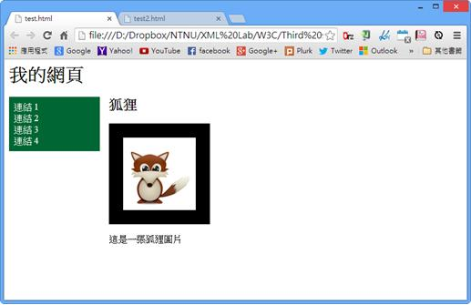
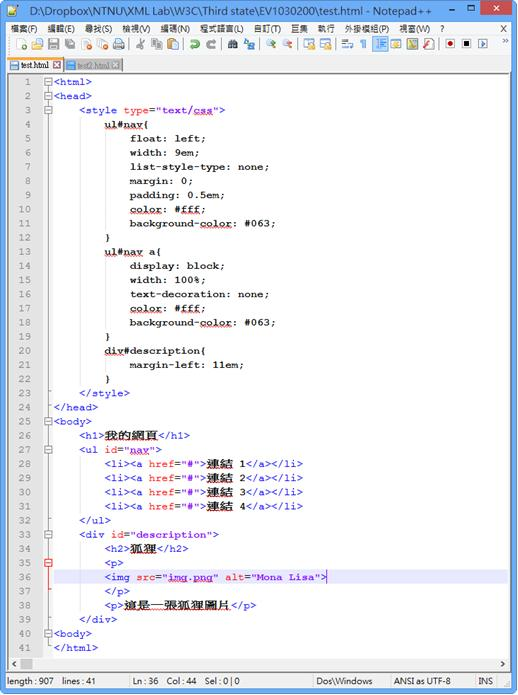
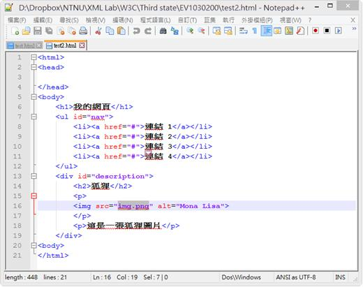
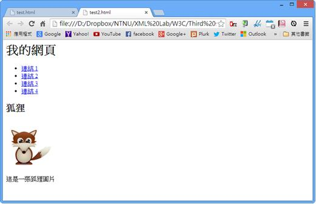

# GN1130200E 將內容依據有意義的序列來排序

- **稽核評量碼**：GN1130200E
- **對應成功準則**：1.3.2
- **對應認證等級**：A
- **對應國際技術碼**：G57
- **類別**：General
- **訊息**：將內容依據有意義的序列來排序
- **英文訊息**：G57: Ordering the content in a meaningful sequence

## 規則說明

任何網頁都必須要遵守此指引。

## 檢測說明

線性化你的網頁內容(例如使用線性化工具、或是手動移除任何排版的要素或屬性)。

檢查此時網頁內容是否仍能保持其原本排版所想表達的樣子。

- 原本的網頁
- 原本的程式碼
- 移除排版標籤的程式碼
- 移除排版標籤以及屬性的網頁。網頁內容變成由上到下排序，但網頁仍舊保持基本想傳達的訊息，不會因為位置改變而錯亂。

## 說明

無

## 範例

**圖片說明：** 展示網頁「我的網頁」的原始頁面佈局。頁面包含左側導航菜單（「課程1」、「課程2」、「課程3」、「課程4」以綠色背景顯示），右側主要內容區域標題為「狐狸」，下方有一個狐狸圖像和描述文字「這是一隻狐狸圖片」。此圖展示具有有意義結構的網頁佈局。

**圖片說明：** 展示HTML原始碼視圖。代碼包含<html>、<head>、<style>標籤定義CSS樣式（包含float、width等佈局屬性），以及<body>標籤內的內容結構：<h1>「我的網頁」</h1>、<ul>列表包含四個<li><a>連結項目（「課程1」、「課程2」、「課程3」、「課程4」），<h2>「狐狸」</h2>標題，
包含<h2>「狐狸</h2>」和圖像。此代碼展示HTML結構與CSS樣式分離的方式。

**圖片說明：** 展示Notepad編輯器中的HTML代碼片段。代碼顯示<h1>「我的網頁」</h1>、<ul>列表、四個<li><a href="">連結、<h2>「狐狸」</h2>標題、圖像元素等。下方有藍色高亮區域標示「」片段。此圖展示HTML代碼結構。

**圖片說明：** 展示移除CSS樣式後的線性化網頁內容。頁面現在呈現為線性列表，包含四個帶下劃線的超連結（「課程1」、「課程2」、「課程3」、「課程4」），下方標題「狐狸」，再下方為狐狸圖像和描述文字「這是一隻狐狸圖片」。此圖展示當移除視覺佈局後，內容仍保持有意義的邏輯順序，原有的導航結構（課程列表）仍在主要內容（狐狸信息）之前，確保了語義的一致性。
