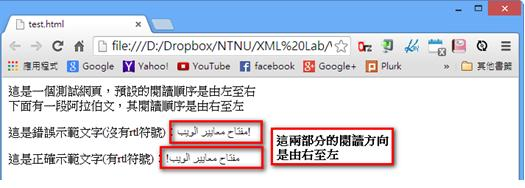
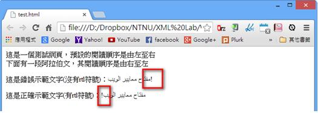
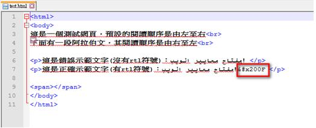

# GN1130201E 使用萬國碼的右至左標記(RLM)或左至右標記(LRM)來即席混用文字走向，或在行內組件使用文字方向屬性以解決巢狀文字走向的問題

- **稽核評量碼**：GN1130201E
- **對應成功準則**：1.3.2
- **對應認證等級**：A
- **對應國際技術碼**：H34、H56
- **類別**：General
- **訊息**：使用萬國碼的右至左標記(RLM)或左至右標記(LRM)來即席混用文字走向，或在行內組件使用文字方向屬性以解決巢狀文字走向的問題
- **英文訊息**：H34: Using a Unicode right-to-left mark (RLM) or left-to-right mark (LRM) to mix text direction inline / H56: Using the dir attribute on an inline element to resolve problems with nested directional runs

## 規則說明

任何需要同時顯示左至右的語言文字(例如英文)，以及右至左的語言文字(例如阿拉伯文)的網頁，都必須要遵守此指引。

## 檢測說明

檢查網頁內容是否有出現閱讀文字方向改變的情形。如果有，則找出其位置。

當文字方向改變時，檢查緊貼在文字旁的中性的符號(沒有方向性的符號)，例如空白、標點符號等，是否出現在不對的位置。

如果是，表示HTML的Bidirectional Algorithm將這些中性符號放在不對的位置，請檢查這些符號的後面是否有使用Unicode的right-to-left或left-to-right符號，以便讓中性符號顯示在正確的位置。

## 說明

無

## 範例

**圖片說明：** 展示混合文字方向的網頁。頁面包含繁體中文文字和阿拉伯語文字的混合內容。文字包括「這是一個測試頁面」、「預設的閱讀順序是由右至左」、「下面有一些阿拉伯文字」等中文敘述，以及兩行阿拉伯語文本（بسم 等）。其中一行阿拉伯文被紅色方框標示，另外有一個灰色框標示「這兩部分的閱讀方向是由右至左」的說明。此圖展示同時包含左至右（LTR）和右至左（RTL）文字的頁面。

**圖片說明：** 展示相同網頁的另一個視圖，強調文字方向的問題區域。中文文字「這是提供示範文字沒有符號」和「這是正確示範文字 (沒有符號)」被顯示，下方是阿拉伯文本「المتجر مختلف وظيفة」和「ت سi بالل」，其中後者被紅色方框標示，說明了符號放置不當的情況。此圖展示文字方向混合時可能出現的符號位置問題。

**圖片說明：** 展示HTML原始碼。代碼包含<html>、<body>標籤。第3行顯示「這是一個測試頁面」，第5行「
這是提供示範文字(沒有符號)：اپنے
」，第6行「
這是正確示範文字字(沒有符號)：ی اپنے
」（被紅色方框標示）。此代碼結構顯示如何在HTML中混合中文和阿拉伯語文本，並通過適當的標籤和Unicode字符（如RLM或LRM）來解決文字方向的問題。第6行中&#x200F;代碼片段（被紅色方框標示）表示使用Unicode右至左標記（RLM）來修正文字方向。
