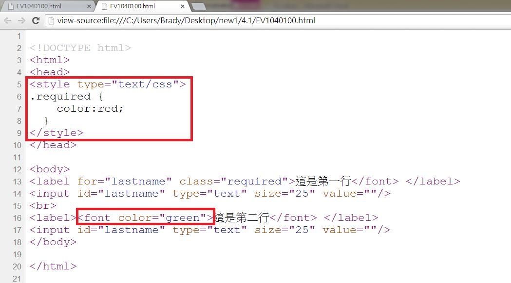
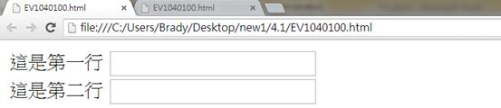

# GN1140100E 確保所有藉由顏色所傳達出來的訊息，在沒有顏色後仍然能夠傳達出來

- **稽核評量碼**：GN1140100E
- **對應成功準則**：1.4.1
- **對應認證等級**：A
- **對應國際技術碼**：G14、G111、G182、G183
- **類別**：General
- **訊息**：確保所有藉由顏色所傳達出來的訊息，在沒有顏色後仍然能夠傳達出來
- **英文訊息**：G14: Ensuring that information conveyed by color differences is also available in text / G111: Using color and pattern / G182: Ensuring that additional visual cues are available when text color differences are used to convey information / G183: Using a contrast ratio of 3:1 with surrounding text and providing additional visual cues on focus for links or controls where color alone is used to identify them

## 規則說明

任何技術運用文字和顏色傳達訊息的網頁，都必須要遵守此指引。

## 檢測說明

使用chrome開啟檔案，大多數的使用者可以經由顏色的差異得到傳達的信息，但有些使用者無法辨識顏色的也可以經由文字內容來判斷。

檢視原始碼，上方的紅色框的required部分為紅色字部分的程式碼，此為使用CSS的方法來改變文字顏色，下方紅色框使用另一種程式碼來指定顏色，此部分指定文字顯示綠色。

若去掉以上紅色框出部分的程式碼，則會顯示原來預設的顏色。

## 說明

無
## 範例

**圖片說明：** 設計示例，說明如何透過色彩加上文字或其他視覺線索來傳達訊息，確保色覺辨識障礙者也能理解。

**圖片說明：** HTML原始碼截圖，展示使用CSS樣式透過顏色（如紅色和綠色）和文字內容（『這是第一行』、『這是第二行』）同時傳達訊息，確保色覺障礙使用者亦能理解。

**圖片說明：** 設計示例，說明如何透過色彩加上文字或其他視覺線索來傳達訊息，確保色覺辨識障礙者也能理解。