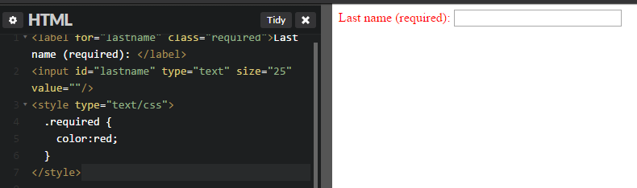

# GN1140102E 對有顏色的表單控制標題，提供文字線索提示

- **稽核評量碼**：GN1140102E
- **對應成功準則**：1.4.1
- **對應認證等級**：A
- **對應國際技術碼**：G205
- **類別**：General
- **訊息**：對有顏色的表單控制標題，提供文字線索提示
- **英文訊息**：G205: Including a text cue for colored form control labels

## 規則說明

有顏色表單控制標題，需要有文字提示，否則檢測失敗；亦即，若表單控制標題有特別顏色存在，檢查其是否有適當的文字提示，若有適當文字提示，則通過檢測。

## 檢測說明

使用文字required代替紅色字體來提供線索提示

原始碼：
```html
<label for="lastname" class="required">Last name (required): </label>
<input id="lastname" type="text" size="25" value=""/>
<style type="text/css">
  .required { color:red; }
</style>
```

## 說明

無
## 範例



**圖片說明：** 設計示例，說明如何透過色彩加上文字或其他視覺線索來傳達訊息，確保色覺辨識障礙者也能理解。