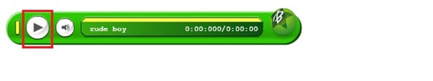

# GN1140200E 除非聲音在三秒鐘內會自動關閉，或者在靠近頁面開頭處有提供可以關閉自動播放的聲音的控制元件，否則只有當使用者請求時才播放聲音

- **稽核評量碼**：GN1140200E
- **對應成功準則**：1.4.2
- **對應認證等級**：A
- **對應國際技術碼**：G60、G170、G171
- **類別**：General
- **訊息**：除非聲音在3秒鐘內會自動關閉，或者在靠近頁面開頭處有提供可以關閉自動播放的聲音的控制元件，否則只有當使用者請求時才播放聲音
- **英文訊息**：G60: Playing a sound that turns off automatically within three seconds / G170: Providing a control near the beginning of the Web page that turns off sounds that play automatically / G171: Playing sounds only on user request

## 規則說明

任何在HTML或XHTML的網頁內，若含有播放聲音的內容時，都須遵守此指引。

## 檢測說明

檢查開啟網頁時聲音是否會在三秒鐘內關閉，或是開頭處有提供可以關閉自動撥放聲音的控制元件。

如果沒有在三秒鐘內關閉，且未提供可以關閉自動撥放的控制元件，則需改成只有當使用者有需求時才撥放聲音。

## 說明

無
## 範例

**圖片說明：** 文字或標籤的簡潔示例截圖。

**圖片說明：** 介面元素或設計示例的中等規模截圖。