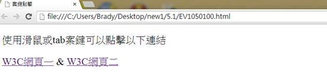
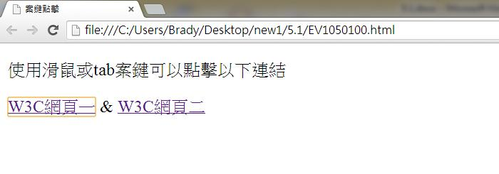
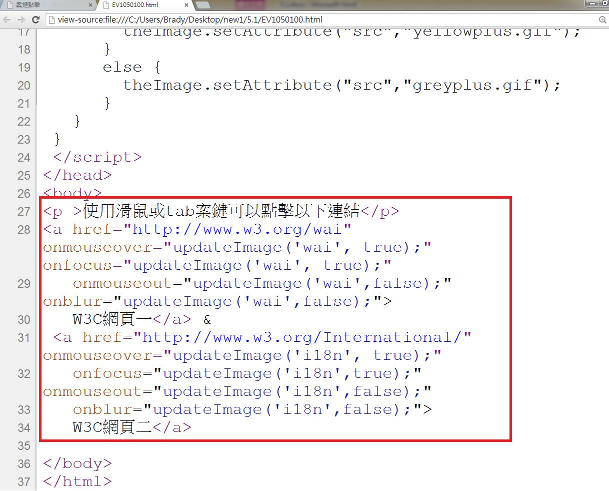

# GN1210100E 提供由鍵盤觸發的事件處理程式

- **稽核評量碼**：GN1210100E
- **對應成功準則**：2.1.1
- **對應認證等級**：A
- **對應國際技術碼**：G90
- **類別**：General
- **訊息**：提供由鍵盤觸發的事件處理程式
- **英文訊息**：G90: Providing keyboard-triggered event handlers

## 規則說明

任何事件無論是鍵盤還是滑鼠的事件皆可由鍵盤來完成，都必須要遵守此指引。

## 檢測說明

1. 用chrome打開檔案，以下兩個連結既可以用滑鼠點擊也可以用鍵盤去操作。
2. 這裡使用tab鍵可取代滑鼠點擊的功能，如此無論是鍵盤還是滑鼠的事件皆可由鍵盤來完成。
3. 檢視原始碼，此原始碼可呼叫javascript內的函式來執行以上所需的功能。

## 說明

無

## 範例

**圖片說明：** 瀏覽器（Chrome）開啟範例頁面，頁面上顯示「使用滑鼠或tab鍵可以點擊以下連結」的說明文字，下方有「W3C網頁一 & W3C網頁二」兩個超連結，連結目前呈現未選取的預設狀態（藍色文字）。示範在滑鼠及鍵盤事件均正常運作的情況下，連結的初始外觀。

**圖片說明：** 同一範例頁面，當使用 Tab 鍵將焦點移至「W3C網頁一」連結時，該連結顯示為橘色底線文字，代表焦點已落在該元素上。示範鍵盤 Tab 鍵能夠正確觸發 `onfocus` 事件，與滑鼠 `onmouseover` 事件等效，達到鍵盤可及性。

**圖片說明：** 瀏覽器以「檢視原始碼」模式開啟同一頁面，以紅色框線標示出關鍵的 HTML 程式碼段落。程式碼中可見兩個 `<a>` 元素均同時設有 `onmouseover`/`onmouseout`（滑鼠事件）與 `onfocus`/`onblur`（鍵盤焦點事件）屬性，並呼叫同一個 JavaScript 函式 `updateImage()`，確保滑鼠與鍵盤操作觸發相同的視覺回饋效果。
