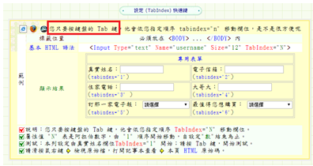
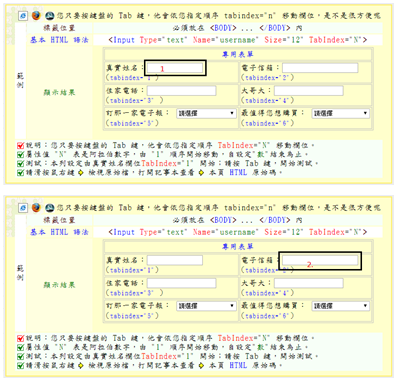
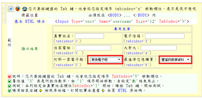
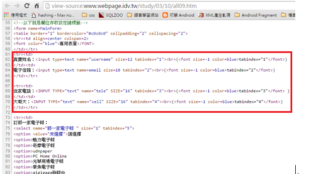

# GN1210101E 確認所有功能都能透過鍵盤介面來操作

- **稽核評量碼**：GN1210101E
- **對應成功準則**：2.1.1
- **對應認證等級**：A
- **對應國際技術碼**：G202
- **類別**：General
- **訊息**：確認所有功能都能透過鍵盤介面來操作
- **英文訊息**：G202: Ensuring keyboard control for all functionality

## 規則說明

檢查是否任何網頁皆能以鍵盤介面來操作。

## 檢測說明

1. 使用tab鍵可取代滑鼠操作的功能，如此無論是鍵盤還是滑鼠的事件皆可由鍵盤來完成。
2. 按下tab鍵會依序跑完所有需要填寫的內容中，不會跳到其他內容。
3. 使用鍵盤上的上下左右鍵即可選擇下拉列表的選項。
4. 檢視原始碼。

## 說明

無

## 範例

**圖片說明：** 瀏覽器開啟範例表單頁面，頁面標題說明「您只要按鍵盤的 Tab 鍵，也會依您指定順序 tabindex="n" 移動欄位」。頁面中有一個包含多個輸入欄位的表單，包括真實姓名、電子信箱、住家電話、大哥大、訂那一家電子報及最值得您信賴的電子報等欄位，每個欄位旁以括號標示 tabindex 順序（tabindex='1' 到 tabindex='6'）。頁面左下方以紅色框線標示說明文字，強調以 tabindex 屬性控制 Tab 鍵移動順序的技術要點。

**圖片說明：** 同一範例表單的兩個連續操作截圖。上半圖顯示焦點（以紅框標示「1」）落在「真實姓名」欄位；下半圖顯示按下 Tab 鍵後，焦點（以紅框標示「2」）依 tabindex 順序移至「電子信箱」欄位。示範 tabindex 屬性能正確控制鍵盤 Tab 鍵在表單欄位間的移動順序。

**圖片說明：** 同一範例表單，Tab 鍵移動至下拉選單欄位的示範截圖。「訂那一家電子報」下拉選單顯示「草魚電子報」選項，「最值得您信賴的電子報」下拉選單則顯示「豐富的學習資料」選項，均以橘色或標示框顯示目前焦點位置。示範鍵盤上下左右鍵可用於操作下拉清單選項，實現完整的鍵盤可及性。

**圖片說明：** 以「檢視原始碼」模式開啟同一表單頁面的 HTML 程式碼，以紅色框線標示關鍵程式碼區段。程式碼顯示各 `<input>` 元素均設有 `tabindex` 屬性（tabindex="1" 至 tabindex="4"），`<select>` 元素亦設有 `tabindex="5"`，確保 Tab 鍵依序在各表單欄位間移動，實現完整的鍵盤介面可操作性。