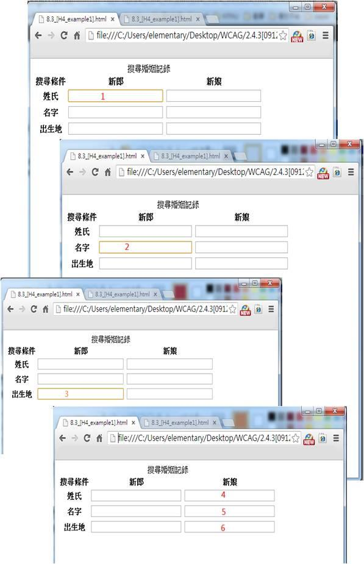

# GN1210200E 確認使用者不會困在內容中

- **稽核評量碼**：GN1210200E
- **對應成功準則**：2.1.2
- **對應認證等級**：A
- **對應國際技術碼**：G21
- **類別**：General
- **訊息**：確認使用者不會困在內容中
- **英文訊息**：G21: Ensuring that users are not trapped in content

## 規則說明

任何網頁皆能以此做測試。

## 檢測說明

1. 按tab鍵，能依序瀏覽所有內容。以此範例為例，按下tab鍵會依序跑完所有需要填寫的內容中，不會跳到其他內容。
2. 若要使用者困在其他內容中，可選擇以下鍵入來取消焦點：Tab、Shift + Tab、Esc、Shift + F10、Alt + Enter、Ctrl + I。

## 說明

無

## 範例

**圖片說明：** 四個連續的瀏覽器截圖，示範在「搜尋婚姻記錄」表單中使用 Tab 鍵依序移動焦點而不會陷入任何欄位的過程。表單包含新郎與新娘各三個欄位（姓氏、名字、出生地）。第一個截圖顯示焦點（橘色框線標示「1」）在新郎姓氏欄位；第二個截圖顯示焦點（標示「2」）移至新郎名字欄位；第三個截圖焦點（標示「3」）移至新郎出生地欄位；第四個截圖顯示焦點依序移至新娘的姓氏（4）、名字（5）、出生地（6）欄位。整個過程 Tab 鍵能順暢依序移動焦點，使用者不會被困在任何內容中。
