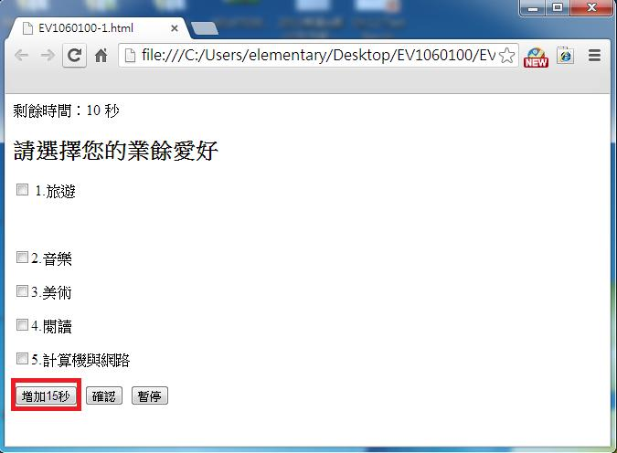
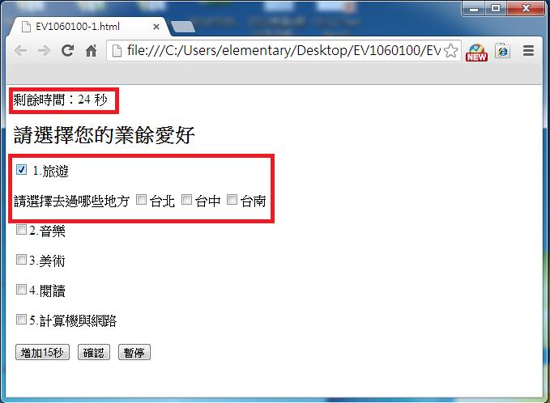

# GN1220100E 在多頁表單的第一頁提供一個核選框，讓使用者可以要求較寬鬆的階段時間限制，或者完全不要有階段時間限制

- **稽核評量碼**：GN1220100E
- **對應成功準則**：2.2.1
- **對應認證等級**：A
- **對應國際技術碼**：G133
- **類別**：General
- **訊息**：在多頁表單的第1頁提供一個核選框，讓使用者可以要求較寬鬆的階段時間限制，或者完全不要有階段時間限制
- **英文訊息**：G133: Providing a checkbox on the first page of a multipart form that allows users to ask for longer session time limit or no session time limit / SCR1: Allowing the user to extend the default time limit

## 規則說明

網頁中有使用到限時填寫的多頁表單，需提供可延長填寫時限的機制。

## 檢測說明

1. 檢查一個含有表單填寫的網頁中，是否有時間限制，若有，則需提供增加填寫時間的選擇。
2. 如果有一些選項被選中時，有另外表格需要填寫時，則需要增加額外時間。

## 說明

無

## 範例

**圖片說明：** 瀏覽器開啟含有時間限制的多頁表單範例頁面，頁面頂部顯示「剩餘時間：10 秒」的倒數計時。表單標題為「請選擇您的業餘愛好」，提供1.旅遊、2.音樂、3.美術、4.閱讀、5.計算機與網路等五個核選框。頁面底部有「增加15秒」（以紅框標示）、「確認」、「暫停」三個按鈕，示範提供延長時間限制機制的正確作法。

**圖片說明：** 同一表單頁面，使用者勾選「1.旅遊」後，頁面動態顯示額外的子問題「請選擇去過哪些地方」並提供台北、台中、台南三個核選框（以紅框標示），頁面頂部「剩餘時間：24 秒」顯示已成功延長填寫時間。示範當選擇某選項後需填寫額外內容時，系統自動增加作答時間的無障礙設計。
