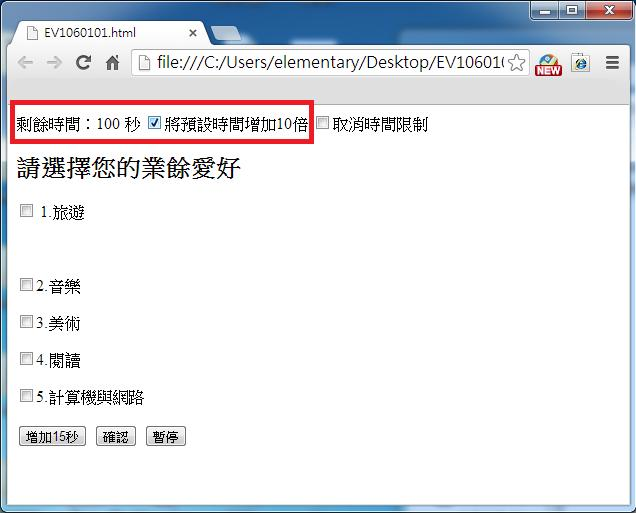
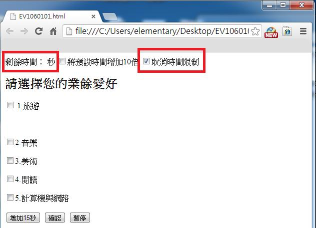

# GN1220101E 提供能讓使用者將時間限制設為預設時間限制十倍，或完全關閉時間限制的方法

- **稽核評量碼**：GN1220101E
- **對應成功準則**：2.2.1
- **對應認證等級**：A
- **對應國際技術碼**：G180
- **類別**：General
- **訊息**：提供能讓使用者將時間限制設為預設時間限制十倍，或完全關閉時間限制的方法
- **英文訊息**：G180: Providing the user with a means to set the time limit to 10 times the default time limit / G198: Providing a way for the user to turn the time limit off

## 規則說明

網頁中有使用到限時填寫的多頁表單，需提供可延長填寫時限的機制。

## 檢測說明

1. 檢查網頁表單填寫是否具有時間限制，並將預設時間更改為原先的10倍。以下範例原先預設時間為10秒，選擇增加10倍後，預設時間變成100秒。
2. 網頁表單填寫若有時間限制，則有一個選項能取消時間限制。

## 說明

無

## 範例

**圖片說明：** 瀏覽器開啟含時間限制的表單範例頁面，頁面頂部（以紅框標示）顯示「剩餘時間：100 秒」，旁邊有「將預設時間增加10倍」核選框（已勾選）與「取消時間限制」核選框（未勾選）。表單標題為「請選擇您的業餘愛好」，提供旅遊、音樂、美術、閱讀、計算機與網路等選項，底部有「增加15秒」、「確認」、「暫停」按鈕。示範勾選「將預設時間增加10倍」後，原預設10秒變為100秒的效果。

**圖片說明：** 同一表單頁面，改為勾選「取消時間限制」核選框（以紅框標示，已打勾），「將預設時間增加10倍」核選框則未勾選。頁面頂部「剩餘時間：秒」的數字欄位為空白，示範完全取消時間限制後計時器停止運作的效果，讓使用者能在無時間壓力的情況下完成表單填寫。
