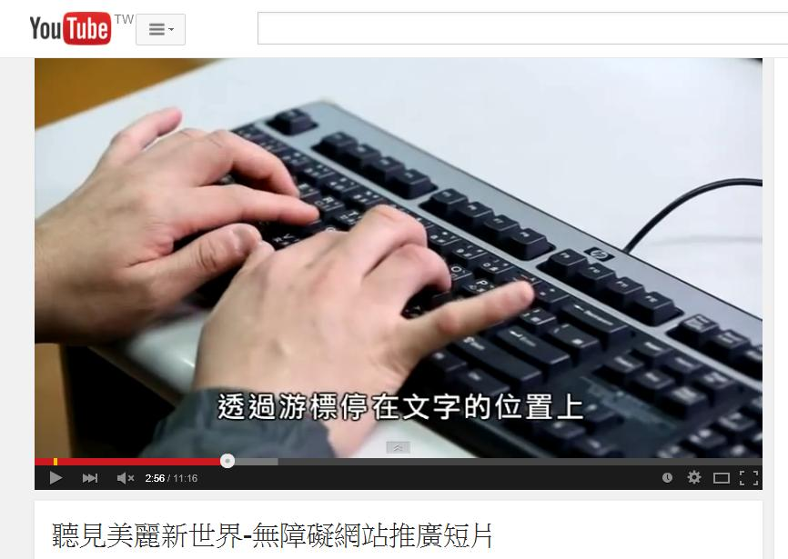

# GN1220200E 讓內容能加以暫停，並可從暫停處重新開始

- **稽核評量碼**：GN1220200E
- **對應成功準則**：2.2.2
- **對應認證等級**：A
- **對應國際技術碼**：G4
- **類別**：General
- **訊息**：讓內容能加以暫停，並可從暫停處重新開始
- **英文訊息**：G4: Allowing the content to be paused and restarted from where it was paused

## 規則說明

網頁上若有動態物件，如動畫或影片，則須符合此指引。

## 檢測說明

1. 以youtube影片為例，當影片正播放時，以youtube所設之暫停方式(1.直接用滑鼠點影片或2.點影片左下方暫停鍵或3.按空白鍵)讓影片停下來。
2. 觀察以確定影片已暫停且並沒有從頭開始。
3. 接著使用youtube所設之繼續播放影片方式(直接用滑鼠點影片或2.點影片左下方播放鍵或3.按空白鍵)讓影片繼續播放。
4. 觀察以確定影片是從剛才暫停處繼續播放。

## 說明

無

## 範例

**圖片說明：** YouTube 播放器正在播放「聽見美麗新世界-無障礙網站推廣短片」，影片畫面顯示雙手在鍵盤上打字，並有字幕「透過游標停在文字的位置上」。播放進度條顯示目前位置為 2:56/11:16，左下角播放控制區以紅框標示暫停按鈕，示範影片正在播放中的狀態。

**圖片說明：** 同一 YouTube 影片在相同播放位置（2:56/11:16）被暫停後的狀態，影片畫面停止在雙手打鍵盤的畫面，字幕「透過游標停在文字的位置上」仍顯示。播放控制列顯示暫停圖示，進度條位置維持不變，示範影片能在任意位置暫停且畫面凍結在該時間點。

**圖片說明：** 同一 YouTube 影片從暫停處重新繼續播放的狀態，播放進度仍為 2:56/11:16，影片畫面與字幕與暫停前相同，左下角播放按鈕（以紅框標示）顯示播放中的圖示。示範影片在暫停後能從暫停處重新開始播放，而非從頭開始，符合無障礙可暫停並重新開始的要求。
