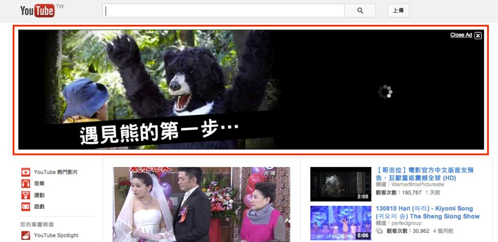

# GN1220201E 建立閃動少於5秒鐘的內容

- **稽核評量碼**：GN1220201E
- **對應成功準則**：2.2.2
- **對應認證等級**：A
- **對應國際技術碼**：G11
- **類別**：General
- **訊息**：建立閃動少於5秒鐘的內容
- **英文訊息**：G11: Creating content that blinks for less than 5 seconds / SCR22: Using scripts to control blinking and stop it in five seconds or less

## 規則說明

網頁上任何會自動閃動的物件內容如flash動畫，必須符合此指引。

## 檢測說明

1. 找出網頁上任何會閃動的內容。
2. 確保此動態閃動必須短於5秒內(包括閃動的間隔及短影片全部播放的總時間)。

## 說明

無

## 範例

**圖片說明：** YouTube 首頁截圖，頁面頂部以紅框標示一段自動播放的廣告影片，畫面顯示一名角色遇見黑熊的場景，並有「遇見熊的第一步…」的字幕文字。廣告右上角有「Close Ad」關閉按鈕。此廣告為閃動少於5秒的動態內容範例，示範頁面上的動態閃動內容應在短暫播放後可由使用者關閉或自動停止。
