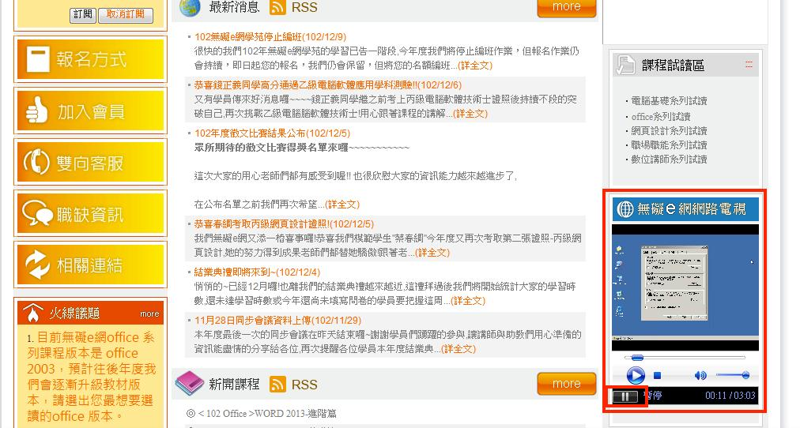

# GN1220202E 在網頁內使用可以停止移動、閃動、自動更新等內容的控制元件

- **稽核評量碼**：GN1220202E
- **對應成功準則**：2.2.2
- **對應認證等級**：A
- **對應國際技術碼**：G186
- **類別**：General
- **訊息**：在網頁內使用可以停止移動、閃動、自動更新等內容的控制元件
- **英文訊息**：G186: Using a control in the Web page that stops moving, blinking, or auto-updating content

## 規則說明

網頁上任何會自動播放的閃動或音效等，必須符合此指引。

## 檢測說明

1. 以無礙e網為例，首頁上有自動播放解說功能，觀察此物件，找到可以控制其暫停的方法(按player左下角的暫停鈕)。
2. 按下暫停鈕。
3. 確認播放內容已被暫停，以此例即聲音暫停播放。

## 說明

無

## 範例

**圖片說明：** 「無礙e網」網站首頁截圖，右側以紅框標示「無礙e網路電視」播放器區塊，播放器正在自動播放一段課程解說影片，播放進度顯示為 00:11/03:03。播放器底部控制列以紅框標示「暫停」按鈕，示範頁面提供可停止自動播放動態內容的控制元件，使用者可點擊暫停按鈕停止影片播放，符合無障礙要求。
