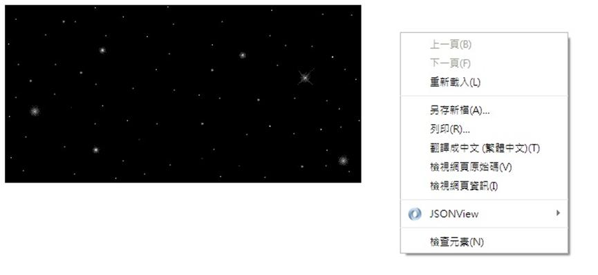
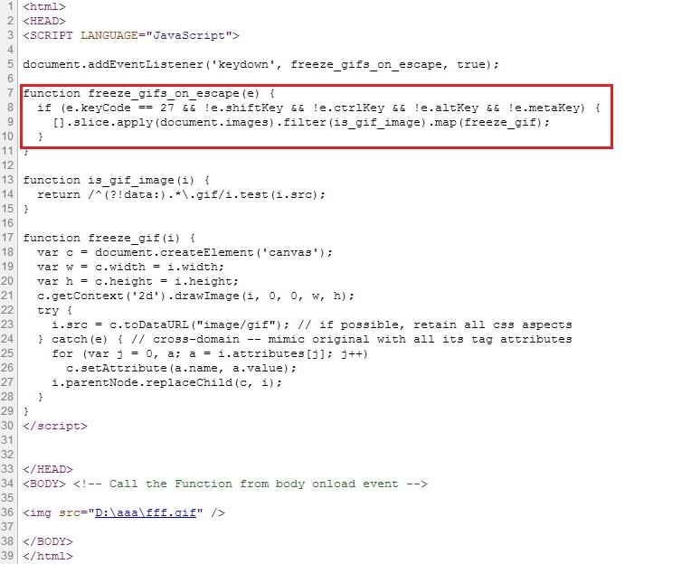

# GN1220203E 使用能由使用者代理關閉閃動內容的科技

- **稽核評量碼**：GN1220203E
- **對應成功準則**：2.2.2
- **對應認證等級**：A
- **對應國際技術碼**：G187
- **類別**：General
- **訊息**：使用能由使用者代理關閉閃動內容的科技
- **英文訊息**：G187: Using a technology to include blinking content that can be turned off via the user agent

## 規則說明

任何運用HTML或XHTML無障礙的網頁，都必須要遵守此指引。

## 檢測說明

1. 使用Google Chrome「檢視原始碼」顯示連結(按下右鍵→檢視原始碼)。
2. 檢查是否在Javascript裡加入按鍵ESC功能，當按下ESC按鍵即可關閉動態圖片閃爍。

## 說明

無

## 範例

**圖片說明：** 瀏覽器頁面左側顯示一個黑色背景、閃爍星星的動態 GIF 動畫。右側顯示在頁面上按滑鼠右鍵所展開的瀏覽器右鍵選單，選單項目包括「上一頁」、「重新載入」、「檢視頁面原始碼」、「檢視頁面資訊」等，示範可透過右鍵選單取得原始碼來驗證是否加入 ESC 鍵關閉閃動內容的功能。

**圖片說明：** 「檢視頁面原始碼」模式顯示的 HTML 程式碼，以紅框標示關鍵的 JavaScript 函式 `freeze_gifs_on_escape`。程式碼在第5行透過 `document.addEventListener('keydown', freeze_gifs_on_escape, true)` 監聽鍵盤事件；第7至10行的函式判斷按鍵是否為 ESC 鍵（keyCode == 27），若是則呼叫 `freeze_gif()` 函式將頁面上所有 GIF 動畫凍結停止。示範使用 JavaScript 實作透過 ESC 鍵讓使用者關閉閃動內容的無障礙技術。
