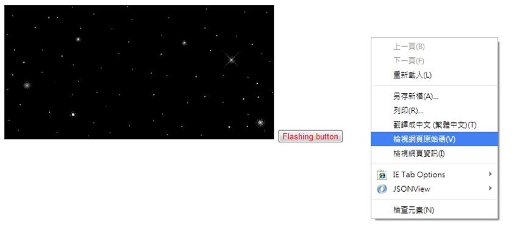
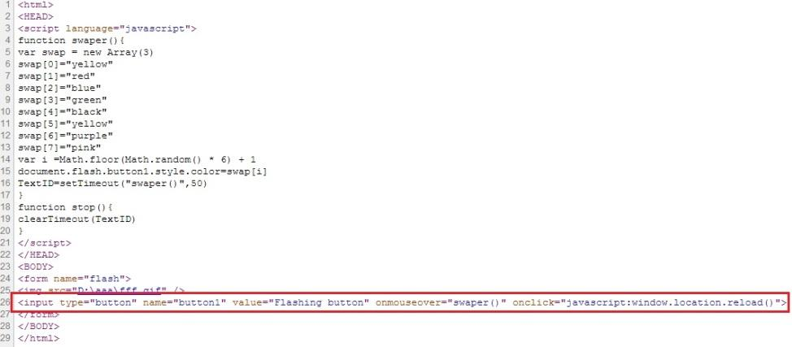
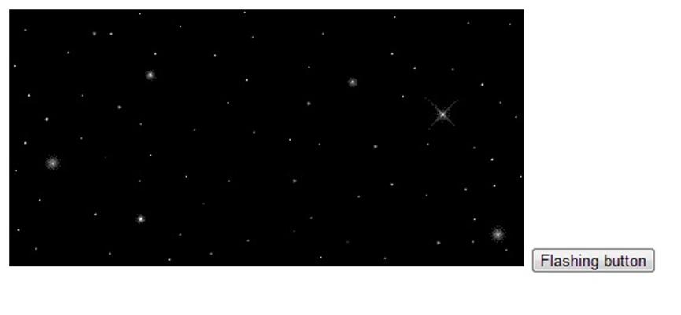

# GN1220204E 提供鏈結、按鈕，或任何可以不閃動內容即重新載入頁面的機制

- **稽核評量碼**：GN1220204E
- **對應成功準則**：2.2.2
- **對應認證等級**：A
- **對應國際技術碼**：G191
- **類別**：General
- **訊息**：提供鏈結、按鈕，或任何可以不閃動內容即重新載入頁面的機制
- **英文訊息**：G191: Providing a link, button, or other mechanism that reloads the page without any blinking content

## 規則說明

任何運用HTML或XHTML網頁，都必須要遵守此指引。

## 檢測說明

1. 使用Google Chrome「檢視原始碼」顯示連結(按下右鍵→檢視原始碼)。
2. 檢查是否在加入按鍵功能，語法onclick="javascript:window.location.reload()"當滑鼠按下按鍵即重新整理頁面，且停止閃爍內容。
3. 測試結果，閃爍內容停止，而且原本網頁的意義也能如實表達。

## 說明

無

## 範例

**圖片說明：** 頁面左側顯示閃爍星星的動態 GIF 動畫，動畫旁有「Flashing button」按鈕。右側顯示右鍵選單，其中「檢視網頁原始碼」選項以藍色反白標示，說明可透過此方式取得原始碼，驗證是否提供重新載入頁面並停止閃動的機制。

**圖片說明：** 「檢視網頁原始碼」顯示的 HTML 程式碼，以紅框標示第26行關鍵程式碼：`<input type="button" name="button1" value="Flashing button" onmouseover="swaper()" onclick="javascript:window.location.reload()">`。其中 `onclick` 屬性設定點擊按鈕後執行 `window.location.reload()`，重新載入頁面時動態閃爍動畫會暫時停止。上方的 `swaper()` 函式負責以亂數切換按鈕顏色產生閃爍效果。

**圖片說明：** 點擊「Flashing button」按鈕後，頁面重新載入的結果截圖。黑色星空動態 GIF 動畫仍在頁面上，「Flashing button」按鈕位於右下角，示範透過重新載入頁面的方式讓閃動內容暫時停止，驗證此機制能正常運作且頁面內容意義完整呈現。
