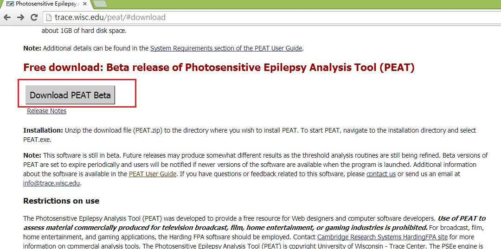
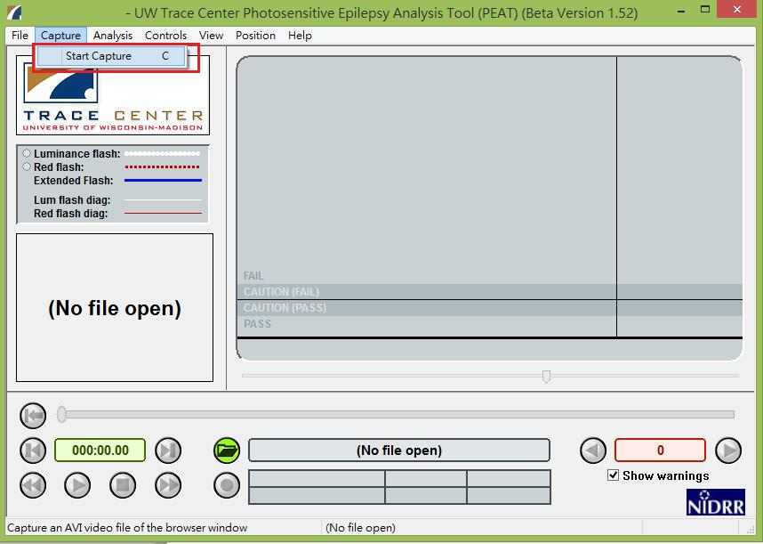
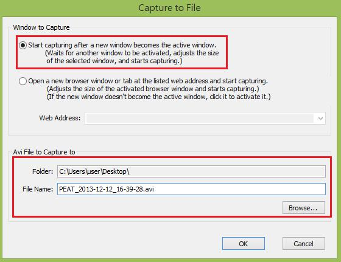
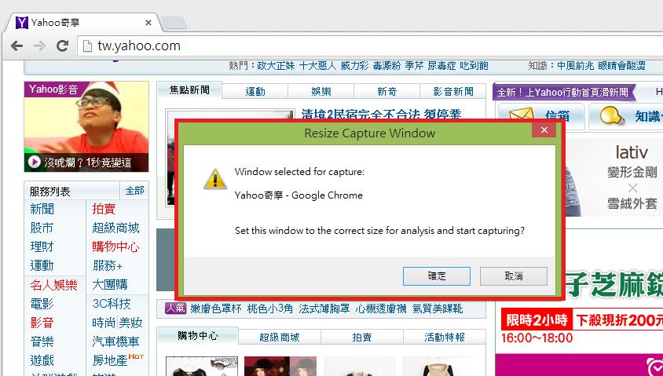
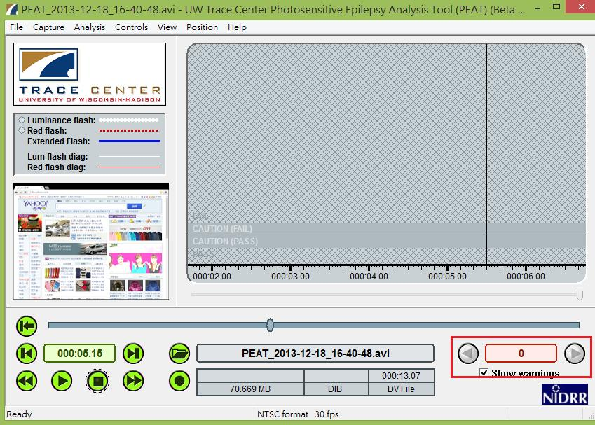

# GN1230100E 使用工具來確認內容不會超出一般閃爍閾值或紅閃爍閾值

- **稽核評量碼**：GN1230100E
- **對應成功準則**：2.3.1
- **對應認證等級**：A
- **對應國際技術碼**：G15
- **類別**：General
- **訊息**：使用工具來確認內容不會超出一般閃爍閾值或紅閃爍閾值，或者確認在任何1秒鐘的週期內，沒有任何內容標籤會閃爍超過3次
- **英文訊息**：G15: Using a tool to ensure that content does not violate the general flash threshold or red flash threshold / G19: Ensuring that no component of the content flashes more than three times in any 1-second period

## 規則說明

任何運用HTML或XHTML在檢驗某網站時，若需確認沒有任何網頁內容於任一秒鐘內有閃爍超過三次的情形，須遵守此指引。

## 檢測說明

1. 下載光敏性癲癇分析工具「PEAT 軟體」，軟體載點於 https://trace.umd.edu/peat/，此軟體可以幫助作者確定其網頁內容的動畫或視頻等是否有可能引起癲癇發作(如網頁內容標籤閃爍超過三次的刺激性)。
2. 下載「PEAT 軟體」後，點選選單列中的Capture→Start Capture，此選項可以捕捉網頁內容的畫面。
3. 點選第一個選項start capturing after a new window becomes the active window，並選擇捕捉網頁後的存檔位置(Avi File to Capture to)。
4. 點選一下要捕捉的網頁畫面，此時會有彈跳視窗詢問是否要捕捉此網頁，案確定後，即可開始錄製網頁畫面，要停止錄製，請按停止按鈕。
5. 錄製好此網頁後可以開始進行分析，此時可以點選進行網頁的分析(分析時Show warning需打勾)，此軟體會分析網頁中的光敏性危險提供警告訊息，以避免癲癇的發生(下圖為偵測到在任何一秒鐘內，有閃爍超過三次的警告)，以下範例Show warning 為0表示此網頁不會出現光敏性危險。

## 說明

無

## 範例

**圖片說明：** PEAT（光敏性癲癇分析工具）軟體下載頁面（trace.wisc.edu/peat/#download），頁面顯示「Free download: Beta release of Photosensitive Epilepsy Analysis Tool (PEAT)」標題，以紅框標示「Download PEAT Beta」下載按鈕，下方說明安裝方式為解壓縮 PEAT.zip 並執行 PEAT.exe，以及使用限制說明。

**圖片說明：** PEAT 軟體主介面截圖（Beta Version 1.52），顯示「UW Trace Center Photosensitive Epilepsy Analysis Tool」工具列。以紅框標示選單列中「Capture → Start Capture」選項，此功能可錄製瀏覽器視窗的畫面。左側面板顯示 Luminance flash、Red flash、Extended Flash 等分析指標，右側主區域顯示 FAIL/CAUTION/PASS 分析結果區，底部警告計數顯示「0」並勾選「Show warnings」。

**圖片說明：** PEAT「Capture to File」對話框截圖，以紅框標示兩個設定區域：上方「Window to Capture」選擇「Start capturing after a new window becomes the active window」選項（已選取）；下方「Avi File to Capture to」設定錄製檔案存放路徑為 `C:\Users\user\Desktop\`，檔案名稱為 `PEAT_2013-12-12_16-39-28.avi`。示範選擇錄製目標視窗與設定存檔位置的步驟。

**圖片說明：** Yahoo 奇摩首頁被選為 PEAT 錄製目標後彈出的「Resize Capture Window」確認對話框，對話框顯示「Window selected for capture: Yahoo奇摩 - Google Chrome」及「Set this window to the correct size for analysis and start capturing?」詢問，並提供「確定」與「取消」按鈕。示範點擊要錄製的網頁視窗後，PEAT 詢問是否開始錄製的流程。

**圖片說明：** PEAT 軟體完成分析錄製好的 Yahoo 奇摩首頁影片（PEAT_2013-12-18_16-40-48.avi，70.669 MB，共13.07秒）後的結果畫面。左側縮圖顯示 Yahoo 首頁畫面，右側分析圖表的閃爍波形線均落在 CAUTION(PASS) 以下的安全範圍。底部以紅框標示警告計數顯示「0」，代表此網頁沒有超出閃爍閾值，不會引發光敏性危險，符合無障礙要求。