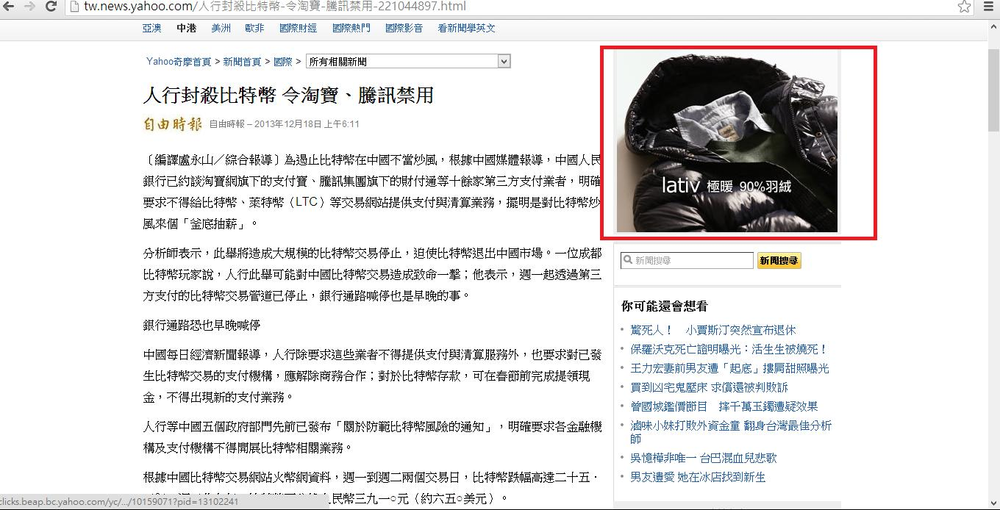

# GN1230101E 能讓閃爍區域保持夠小

- **稽核評量碼**：GN1230101E
- **對應成功準則**：2.3.1
- **對應認證等級**：A
- **對應國際技術碼**：G176
- **類別**：General
- **訊息**：能讓閃爍區域保持夠小
- **英文訊息**：G176: Keeping the flashing area small enough

## 規則說明

適用於一般的web內容，能夠在特殊屏幕中能夠使閃爍區域保持夠小時，須遵守此指引。

## 檢測說明

1. 檢查畫面在任何時間中是否只有一個區域在閃爍。
2. 檢查閃爍的區域其面積小於最小安全區域。最小安全區域指的是：
   - Web內容能使閃爍區域保持夠小：最普遍的web顯示尺寸為1024 x 768，對角線約15〜17英寸，如果以距離(22-26英寸)且以10度角觀看的方式，觀看時視野將小於中央屏幕的25％，可見區為一個面積約341×256像素，此為最小的安全區域。
   - 所使用的屏幕(如大廳中所使用的顯示器)能使閃爍區域保持夠小。請參考：https://www.w3.org/TR/WCAG20-TECHS/G176.html

以下範例為：web顯示尺寸為1024 x 768，如果以觀看距離(22-26英寸)且以10度的視野的方式，視野將小於中央屏幕的25％，可見區為一個面積約341×256像素，這可以為最小的安全區域(紅色框起來的地方)。

## 說明

無

## 範例

**圖片說明：** Yahoo 奇摩新聞頁面截圖（1024x768 解析度顯示），右上角以紅框標示一個廣告橫幅區塊（顯示 lativ 品牌羽絨衣廣告），此紅框範圍即代表最小安全閃爍區域（約 341×256 像素）。新聞標題為「人行封殺比特幣 令淘寶、騰訊禁用」。示範在 1024×768 螢幕解析度下，以 22-26 英寸距離、10 度視野觀看時，閃爍內容的面積應控制在中央螢幕 25% 以內（即紅框所示範圍），以符合不超出一般閃爍閾值的無障礙要求。
