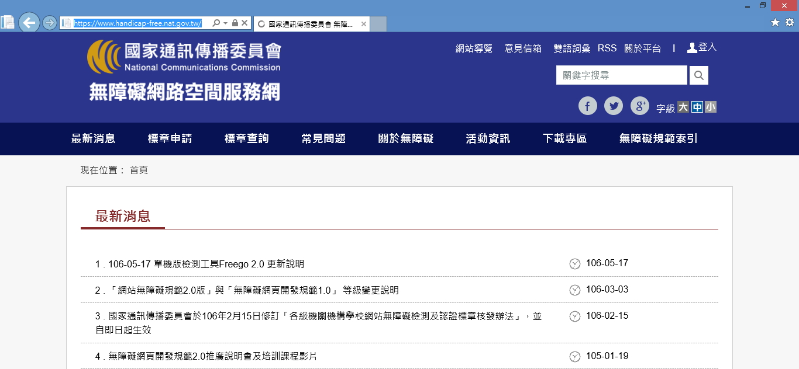
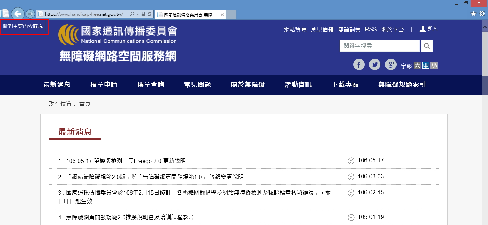

# GN1240100E 在每一個頁面頂端加入一個鏈結，直接連往主要的內容區域

- **稽核評量碼**：GN1240100E
- **對應成功準則**：2.4.1
- **對應認證等級**：A
- **對應國際技術碼**：G1
- **類別**：General
- **訊息**：在每一個頁面頂端加入一個鏈結，直接連往主要的內容區域
- **英文訊息**：G1: Adding a link at the top of each page that goes directly to the main content area

## 規則說明

任何在HTML或XHTML的網頁內存在鏈結，都需要遵守此指引。

## 檢測說明

1. 開啟網頁。
2. 按下鍵盤Tab鍵遊走，並檢視頁面頂端是否出現「跳到主要內容區」連結。

## 說明

無

## 範例

**圖片說明：** 「無障礙網路空間服務網」（國家通訊傳播委員會）首頁截圖，頁面頂部為藍色網站標頭，包含網站標誌、導覽列（最新消息、標章申請、標章查詢等），以及搜尋欄、字級調整等功能。頁面主體顯示「最新消息」區塊，列有多則公告。此截圖為初始載入狀態，尚未按下 Tab 鍵，頁面頂部尚未出現「跳到主要內容區塊」連結。

**圖片說明：** 同一「無障礙網路空間服務網」首頁，按下鍵盤 Tab 鍵後，頁面左上角以紅框標示出現「跳到主要內容區塊」的跳過連結。此連結平時隱藏，在鍵盤聚焦時顯示，讓使用鍵盤或螢幕報讀器的使用者可直接跳過重複的導覽選單，快速進入主要內容區域，符合無障礙設計要求。