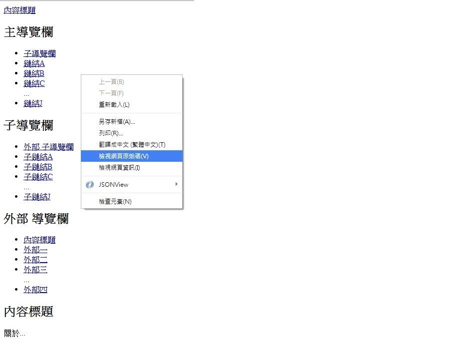
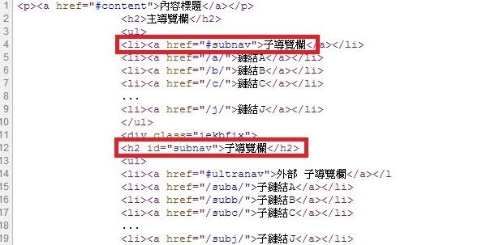

# GN1240101E 在重複內容的區塊開頭加入鏈結，連到該區塊結束之處，或用頁框來群聚重複出現的材料區塊

- **稽核評量碼**：GN1240101E
- **對應成功準則**：2.4.1
- **對應認證等級**：A
- **對應國際技術碼**：G123
- **類別**：General
- **訊息**：在重複內容的區塊開頭加入鏈結，連到該區塊結束之處，或用頁框來群聚重複出現的材料區塊
- **英文訊息**：G123: Adding a link at the beginning of a block of repeated content to go to the end of the block / H70: Using frame elements to group blocks of repeated material

## 規則說明

任何在HTML或XHTML的網頁內存在鏈結，都需要遵守此指引。

## 檢測說明

1. 使用Google Chrome「檢視原始碼」顯示連結 (按下右鍵→檢視原始碼)。
2. 確認程式碼裡鏈結是否可以連往其他區塊。

## 說明

無

## 範例

**圖片說明：** 範例頁面顯示多個導覽區塊，包含「主導覽欄」（含子導覽欄、鏈結A~J）、「子導覽欄」（含外部子導覽欄、子鏈結A~J）、「外部導覽欄」（含內容標題、外部一~四）以及「內容標題」區塊。頁面上有右鍵選單彈出，其中「檢視網頁原始碼」選項以藍色反白標示，示範可透過此方式查看是否在重複導覽區塊開頭加入跳轉鏈結。

**圖片說明：** 「檢視網頁原始碼」顯示的 HTML 程式碼，以紅框標示兩處關鍵程式碼：第4行 `<li><a href="#subnav">子導覽欄</a></li>` 為在主導覽欄區塊開頭加入的跳轉鏈結，可跳至子導覽欄區塊結尾；第12行 `<h2 id="subnav">子導覽欄</h2>` 為對應的目標錨點。示範在重複內容區塊開頭加入鏈結、連到該區塊結束處的正確實作方式，讓鍵盤使用者能快速跳過重複導覽內容。
